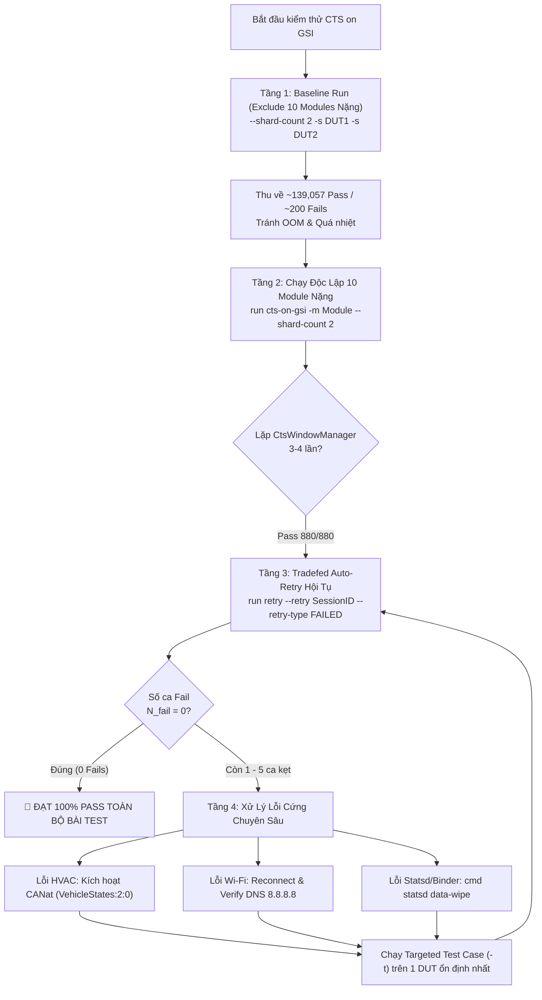

# CTS on GSI (Android Automotive) - Vận Hành & Auto-Retry Đạt 100% Pass

Tài liệu này là quy trình chuẩn (Playbook/Skill) chuyên biệt cho bài kiểm thử **CTS on GSI** (Generic System Image) trên các dòng thiết bị **Android Automotive OS / Car AIVI** (đặc biệt dòng Nissan AIVI trên Android 14 API 34).

Skill này được đúc kết từ thực nghiệm trên **47 sessions kiểm thử thực tế** tại máy chủ `10.218.158.64` (đạt kết quả tuyệt đối: **139,287 / 139,287 test cases PASS - 100% Pass, 0 Fail**).

---

## 📑 MỤC LỤC
1. [Bản Chất CTS on GSI & Điểm Khác Biệt](#1-bản-chất-cts-on-gsi--điểm-khác-biệt)
2. [Cấu Trúc Thư Mục & Môi Trường Kiểm Chuẩn](#2-cấu-trúc-thư-mục--môi-trường-kiểm-chuẩn)
3. [Checklist Chuẩn Bị Thiết Bị (Pre-conditions)](#3-checklist-chuẩn-bị-thiết-bị-pre-conditions)
4. [Chiến Lược 4 Tầng Đạt 100% Pass (The 4-Tier Strategy)](#4-chiến-lược-4-tầng-đạt-100-pass-the-4-tier-strategy)
   - [Tầng 1: Initial Run với Exclude Filter (Tránh quá tải & OOM)](#tầng-1-initial-run-với-exclude-filter)
   - [Tầng 2: Chạy Độc Lập 10 Module Nặng (Targeted Module Isolation)](#tầng-2-chạy-độc-lập-10-module-nặng)
   - [Tầng 3: Vòng Lặp Auto-Retry Tradefed Hội Tụ](#tầng-3-vòng-lặp-auto-retry-tradefed-hội-tụ)
   - [Tầng 4: Xử Lý Lỗi Cứng Đặc Thù Ô Tô (Car VHAL & CANat)](#tầng-4-xử-lý-lỗi-cứng-đặc-thù-ô-tô)
5. [Cẩm Nang Lệnh CTS-Tradefed & ADB](#5-cẩm-nang-lệnh-cts-tradefed--adb)
6. [Kịch Bản Xử Lý Cho AI Agent Trong Các Phiên Sau](#6-kịch-bản-xử-lý-cho-ai-agent-trong-các-phiên-sau)
7. [Tài Liệu & Scripts Đi Kèm](#7-tài-liệu--scripts-đi-kèm)

---

## 1. Bản Chất CTS on GSI & Điểm Khác Biệt

### GSI là gì?
**GSI (Generic System Image)** là bản dựng Android thuần (AOSP) do Google cung cấp, được flash đè lên phân vùng `system` của thiết bị để kiểm tra tính tương thích **Project Treble**. Thiết bị phần cứng và các phân vùng Vendor (`vendor`, `product`, `odm`) phải đáp ứng đầy đủ các HAL interface chuẩn mà Google quy định.

### Sự khác biệt giữa `cts` và `cts-on-gsi`:
- **Test Plan:** Sử dụng kế hoạch kiểm thử `cts-on-gsi` (chạy qua lệnh `run cts-on-gsi`).
- **Tổng số test:** ~139,287 test cases (133 modules).
- **Đặc thù Automotive:** Head Unit chạy GSI sẽ mất các app giao diện tùy biến của nhà sản xuất ô tô. Do đó, các bài test kiểm tra **Vehicle HAL (Car Property, HVAC, Sensor, Multi-Display)** rất dễ fail nếu hệ thống mạng CAN không được giả lập đúng trạng thái xe đang nổ máy (Ignition ON).

---

## 2. Cấu Trúc Thư Mục & Môi Trường Kiểm Chuẩn

### Cấu hình Host chuẩn:
- **Server:** `10.218.158.64` (User: `lge` / Password: `lge@1234`)
- **Thư mục Tradefed:** `/home/lge/GoogleQA/TestFolder/GSI_cf8886c9,d930bf76/android-cts/`
- **Bộ DUT cắm song song:**
  - DUT 1: `cf8886c9`
  - DUT 2: `d930bf76`

### Cấu trúc thư mục Tradefed:
```text
android-cts/
├── tools/
│   └── cts-tradefed           # Binary khởi động Tradefed Console
├── testcases/                 # Kho chứa 133 APKs test modules
├── results/                   # Thư mục lưu kết quả kiểm thử (Session ID = timestamp)
│   ├── 2026.08.10_14.23.10/   # Session 0
│   │   ├── test_result.xml    # File kết quả XML chính
│   │   ├── test_result.html   # Báo cáo HTML trực quan
│   │   └── checksum.previous.zip
│   ├── 2026.08.11_09.12.00/   # Session 1 (Retry từ Session 0)
│   └── ...
└── logs/                      # Logcat và Tradefed host logs theo session
```

---

## 3. Checklist Chuẩn Bị Thiết Bị (Pre-conditions)

Trước khi thực hiện bất kỳ lệnh test nào, **bắt buộc chạy script pre-condition** trên tất cả các DUT:

```bash
# Chạy script tự động có sẵn trong skill:
bash .agents/skills/cts-on-gsi/scripts/precondition_device.sh <serial>
```

### Các bước cấu hình chi tiết (ADB):
1. **Màn hình luôn sáng (Stay Awake):**
   ```bash
   adb -s <serial> shell settings put global stay_on_while_plugged_in 7
   adb -s <serial> shell svc power stayon true
   adb -s <serial> shell input keyevent 224
   ```
2. **Gỡ bỏ màn hình khóa (Dismiss Keyguard):**
   ```bash
   adb -s <serial> shell settings put secure lock_screen_lock_none true
   adb -s <serial> shell wm dismiss-keyguard
   ```
3. **Reset hiển thị về độ phân giải chuẩn:**
   ```bash
   adb -s <serial> shell wm size reset
   adb -s <serial> shell wm density reset
   ```
4. **Ngôn ngữ chuẩn tiếng Anh Mỹ:**
   ```bash
   adb -s <serial> shell 'setprop persist.sys.locale en-US'
   ```
5. **Kết nối mạng Wi-Fi có Internet (Ping Google):**
   ```bash
   bash .agents/skills/cts-on-gsi/scripts/connect_wifi.sh <serial>
   ```

---

## 4. Chiến Lược 4 Tầng Đạt 100% Pass (The 4-Tier Strategy)



---

### Tầng 1: Initial Run với Exclude Filter

> [!WARNING]
> **Tuyệt đối không chạy lệnh `run cts-on-gsi` trần mà không có Exclude Filter.**  
> Chạy đồng thời 139,000 test liên tục trong 20+ tiếng trên thiết bị Automotive sẽ gây tràn bộ nhớ Binder IPC, quá nhiệt (Thermal Throttling) và làm rớt kết nối ADB giữa chừng.

Thực hiện lệnh khởi tạo với 10 modules nặng được loại trừ:
```bash
run cts-on-gsi \
  --exclude-filter "CtsMediaTestCases" \
  --exclude-filter "CtsDeqpTestCases" \
  --exclude-filter "CtsLibcoreTestCases" \
  --exclude-filter "CtsNetTestCases" \
  --exclude-filter "CtsNativeNetDnsTestCases" \
  --exclude-filter "CtsStatsdAtomHostTestCases" \
  --exclude-filter "CtsWindowManagerDeviceTestCases" \
  --exclude-filter "CtsCarTestCases" \
  --exclude-filter "CtsAppTestCases" \
  --exclude-filter "CtsLiblogTestCases" \
  --shard-count 2 -s <DUT1> -s <DUT2>
```
- **Thời gian chạy ước tính:** ~14 đến 16 giờ.
- **Mục tiêu đạt được:** Hoàn thành ~139,057 test case Pass an toàn, số fail chỉ còn khoảng 150 - 200 ca.

---

### Tầng 2: Chạy Độc Lập 10 Module Nặng

Sau khi có Baseline sạch ở Tầng 1, tiến hành chạy riêng biệt từng module đã exclude để cô lập tài nguyên:

```bash
# 1. Đồ họa & Vulkan (Cực nặng)
run cts-on-gsi -m CtsDeqpTestCases --shard-count 2 -s <DUT1> -s <DUT2>

# 2. Đa phương tiện & Codec
run cts-on-gsi -m CtsMediaTestCases --shard-count 2 -s <DUT1> -s <DUT2>

# 3. Thư viện hệ thống
run cts-on-gsi -m CtsLibcoreTestCases --shard-count 2 -s <DUT1> -s <DUT2>

# 4. Mạng & DNS
run cts-on-gsi -m CtsNetTestCases --shard-count 2 -s <DUT1> -s <DUT2>
run cts-on-gsi -m CtsNativeNetDnsTestCases --shard-count 2 -s <DUT1> -s <DUT2>

# 5. Dịch vụ thống kê
run cts-on-gsi -m CtsStatsdAtomHostTestCases --shard-count 2 -s <DUT1> -s <DUT2>

# 6. Quản lý ứng dụng & Log
run cts-on-gsi -m CtsAppTestCases --shard-count 2 -s <DUT1> -s <DUT2>
run cts-on-gsi -m CtsLiblogTestCases --shard-count 2 -s <DUT1> -s <DUT2>

# 7. Quản lý giao diện cửa sổ (Cần lặp 3 lần để hội tụ từ 874 -> 880 Pass)
run cts-on-gsi -m CtsWindowManagerDeviceTestCases --shard-count 2 -s <DUT1> -s <DUT2>
```

---

### Tầng 3: Vòng Lặp Auto-Retry Tradefed Hội Tụ

Tradefed sở hữu cơ chế **Automatic Subplan Merge**: Khi chạy lệnh retry dựa trên một session cũ, Tradefed sẽ tự động gom các kết quả đã Pass trước đó và chỉ thực thi lại các test case bị Fail hoặc NotExecuted.

#### Lệnh thực thi:
```bash
# Lệnh tổng quát:
run retry --retry <latest_session_id> --retry-type FAILED -s <serial>

# Nếu phiên trước bị ngắt giữa chừng do mất kết nối:
run retry --retry <latest_session_id> --retry-type NOT_EXECUTED -s <serial>
```

#### Quy tắc điều khiển vòng lặp:
1. **Bỏ `--shard-count` khi Fail < 20:** Gom về 1 DUT duy nhất có kết nối ổn định nhất (tránh chi phí sharding và xung đột Activity).
2. **Kiểm tra tiến độ bằng script:**
   ```bash
   python3 .agents/skills/cts-on-gsi/scripts/parse_tradefed_results.py <đường_dẫn_results>
   ```
3. **Điều kiện chuyển tầng:** Nếu sau 2 lần retry liên tiếp mà số ca fail không giảm (ví dụ giữ nguyên 2 ca HVAC), **dừng retry Tầng 3 ngay lập tức** và chuyển sang Tầng 4.

---

### Tầng 4: Xử Lý Lỗi Cứng Đặc Thù Ô Tô

---

#### 🚗 Ca 1: Lỗi HVAC Seat/Fan Temperature trong `CtsCarTestCases`
- **Tên test case:**
  - `android.car.cts.CarPropertyManagerTest#testHvacSeatTemperatureIfSupported`
  - `android.car.cts.CarPropertyManagerTest#testHvacFanDirectionIfSupported`
- **Hiện tượng:** Ném ngoại lệ `CarServiceException` hoặc `NOT_AVAILABLE`.
- **Nguyên nhân:** Bản GSI không tự phát sinh tín hiệu CAN bus. ECU xe ở trạng thái Sleep khiến VHAL không phản hồi thuộc tính điều hòa.
- **Cách xử lý triệt để:**
  1. Kích hoạt mô phỏng CAN bus bằng script:
     ```bash
     bash .agents/skills/cts-on-gsi/scripts/setup_car_canat.sh <serial>
     ```
  2. Kiểm tra tín hiệu CAN: đảm bảo `VehicleStates:2:0` (Ignition ON) đã được ghi vào `/dev/canat`.
  3. Chạy đích danh test case:
     ```bash
     run cts-on-gsi -m CtsCarTestCases -t android.car.cts.CarPropertyManagerTest#testHvacSeatTemperatureIfSupported -s <serial>
     run cts-on-gsi -m CtsCarTestCases -t android.car.cts.CarPropertyManagerTest#testHvacFanDirectionIfSupported -s <serial>
     ```
  4. Xác nhận: Kết quả chuyển sang **PASS**.

---

#### 📶 Ca 2: Lỗi Mạng & DNS (`CtsNetTestCases`, `CtsNativeNetDnsTestCases`)
- **Nguyên nhân:** Mất DHCP lease sau thời gian test dài, hoặc router Wi-Fi chặn ICMP ping.
- **Cách xử lý:**
  1. Chạy lại script kết nối Wi-Fi:
     ```bash
     bash .agents/skills/cts-on-gsi/scripts/connect_wifi.sh <serial>
     ```
  2. Kiểm tra route qua ADB:
     ```bash
     adb -s <serial> shell ping -c 3 8.8.8.8
     ```
  3. Retry lại module:
     ```bash
     run retry --retry <latest_session_id> -s <serial> --include-filter CtsNetTestCases
     ```

---

#### 🪟 Ca 3: Lỗi Keyguard & Display (`CtsWindowManagerDeviceTestCases`)
- **Nguyên nhân:** Màn hình bị khóa ngầm hoặc có pop-up đè lên lớp SurfaceFlinger.
- **Cách xử lý:**
  ```bash
  adb -s <serial> shell wm dismiss-keyguard
  adb -s <serial> shell wm size reset
  adb -s <serial> shell input keyevent 3
  run retry --retry <latest_session_id> -s <serial> --include-filter CtsWindowManagerDeviceTestCases
  ```

---

#### 📊 Ca 4: Lỗi Bộ Đệm Statsd (`CtsStatsdAtomHostTestCases`)
- **Cách xử lý:**
  ```bash
  adb -s <serial> shell cmd statsd data-wipe
  run retry --retry <latest_session_id> -s <serial> --include-filter CtsStatsdAtomHostTestCases
  ```

---

## 5. Cẩm Nang Lệnh CTS-Tradefed & ADB

### Trong Tradefed Console:
| Lệnh | Ý nghĩa |
| :--- | :--- |
| `l r` hoặc `list results` | Xem danh sách tất cả các sessions, số Pass, Fail, NotExec |
| `l d` hoặc `list devices` | Xem trạng thái thiết bị (`Available`, `Allocated`, `Unavailable`) |
| `l i` hoặc `list invocations` | Xem tiến trình test đang chạy ngầm trên máy chủ |
| `run cts-on-gsi ...` | Chạy test plan CTS on GSI |
| `run retry --retry <ID> --retry-type FAILED` | Chạy lại toàn bộ ca lỗi của session chỉ định |
| `run retry --retry <ID> --retry-type NOT_EXECUTED` | Chạy lại các ca chưa được thực thi |
| `run retry --retry <ID> -s <serial> --include-filter <Mod>` | Retry riêng 1 module cho session |
| `run cts-on-gsi -m <Mod> -t <Class>#<Method> -s <serial>` | Chạy đích danh 1 test case duy nhất |

### Lệnh ADB Phục Hồi Thiết Bị (Device Recovery):
```bash
# Khởi động lại ADB server nếu mất kết nối
adb kill-server && adb start-server

# Mở sáng và gỡ khóa màn hình
adb -s <serial> shell input keyevent 224 && adb -s <serial> shell wm dismiss-keyguard

# Kiểm tra log VHAL theo thời gian thực
adb -s <serial> logcat -s CarPropertyManager VehicleHal:V
```

---

## 6. Kịch Bản Xử Lý Cho AI Agent Trong Các Phiên Sau

Khi nhận được yêu cầu từ người dùng liên quan đến **CTS on GSI** (ví dụ: *"Chạy test CTS on GSI"*, *"Kiểm tra log/tiến độ retry"*, *"Xử lý các ca fail để đạt 100% pass"*), Agent cần tuân theo quy trình tự động sau:

1. **Bước 1: Xác định Môi Trường & Session Hiện Tại**
   - Kết nối tới server (SSH vào `10.218.158.64` nếu chạy từ xa, hoặc truy cập thư mục TestFolder).
   - Chạy script phân tích kết quả:
     ```bash
     python3 .agents/skills/cts-on-gsi/scripts/parse_tradefed_results.py <results_dir>
     ```
   - Nắm rõ: Session ID mới nhất là bao nhiêu? Còn bao nhiêu Fails? Thuộc module nào?

2. **Bước 2: Phân Loại Lỗi & Quyết Định Hành Động**
   - Nếu chưa có Session nào $\rightarrow$ Thực hiện **Tầng 1 (Baseline Run có Exclude Filter)**.
   - Nếu còn nhiều module chưa chạy $\rightarrow$ Thực hiện **Tầng 2 (Single Isolation cho từng module)**.
   - Nếu chỉ còn các ca flaky ngẫu nhiên (< 30 fails) $\rightarrow$ Thực hiện **Tầng 3 (Tradefed Retry Loop)** trên 1 DUT ổn định.
   - Nếu có ca lỗi thuộc nhóm Car HVAC hoặc Mạng $\rightarrow$ Kích hoạt **Tầng 4 (CANat / Wi-Fi setup)** rồi mới retry.

3. **Bước 3: Thực Thi & Kiểm Tra Điều Kiện Dừng**
   - Trước mỗi lần retry, gọi script `precondition_device.sh`.
   - Chạy lệnh retry tương ứng.
   - Khi hoàn tất, đọc lại file `test_result.xml`.
   - Khi `failed="0"` và `notExecuted="0"` $\rightarrow$ Xác nhận thành công và báo cáo người dùng.

---

## 7. Tài Liệu & Scripts Đi Kèm

- [Case Study 47 Sessions Thực Chiến (Từ 200 Fails -> 100% Pass)](./references/47_sessions_case_study.md)
- [Kiến Trúc Môi Trường Phần Cứng & Mạng Nissan AIVI](./references/nissan_aivi_hardware.md)
- [Script: precondition_device.sh](./scripts/precondition_device.sh)
- [Script: setup_car_canat.sh](./scripts/setup_car_canat.sh)
- [Script: connect_wifi.sh](./scripts/connect_wifi.sh)
- [Script: parse_tradefed_results.py](./scripts/parse_tradefed_results.py)
