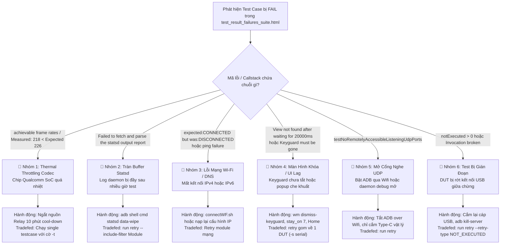

# CTS Test - Cẩm Nang Chẩn Đoán Lỗi & Chỉ Dẫn Hành Động Vận Hành (Advisor Playbook)

Skill này biến AI Agent thành **Chuyên Gia Chẩn Đoán Lỗi CTS (CTS Diagnostic & Command Advisor)** cho hệ thống Android Automotive OS (Nissan AIVI / Head Unit).

Khi người dùng cung cấp đường dẫn hoặc yêu cầu kiểm tra trạng thái một hoặc nhiều session test, Agent **không chạy script ở máy local**, mà trực tiếp phân tích file báo cáo lỗi **`test_result_failures_suite.html`**, xác định nguyên nhân gốc rễ và đưa ra **Phương án hành động chuẩn xác 100%** gồm:
1. **Can thiệp phần cứng / thiết bị:** Cần Hard reboot (Relay PCB), Soft reboot (`adb reboot`), Cool-down hạ nhiệt chip, kết nối Wi-Fi (IPv4 / IPv6), mở khóa màn hình, dọn statsd, hay Factory reset?
2. **Bộ câu lệnh Tradefed chính xác từng ký tự:** Chỉ rõ cờ `--retry-type FAILED`, `NOT_EXECUTED`, `--include-filter`, `--exclude-filter`, `--shard-count`, gom 1 DUT (`-s <serial>`), hoặc chạy đích danh `-m <Module> -t <Class>#<Method>`.

---

## 📑 MỤC LỤC
1. [Quy Trình Phân Tích Báo Cáo Session (Failure HTML First)](#1-quy-trình-phân-tích-báo-cáo-session-failure-html-first)
2. [Cây Quyết Định Chẩn Đoán Lỗi (Root Cause Decision Tree)](#2-cây-quyết-định-chẩn-đoán-lỗi-root-cause-decision-tree)
3. [Ma Trận Phương Án Hành Động: Thiết Bị & Câu Lệnh Tradefed](#3-ma-trận-phương-án-hành-động-thiết-bị--câu-lệnh-tradefed)
   - [Ca 1: Hạ Xung Codec Do Quá Nhiệt (Thermal Throttling)](#ca-1-hạ-xung-codec-do-quá-nhiệt-thermal-throttling)
   - [Ca 2: Tràn Bộ Đệm Statsd Telemetry Report](#ca-2-tràn-bộ-đệm-statsd-telemetry-report)
   - [Ca 3: Lỗi Mạng Wi-Fi (IPv4 / IPv6 / DNS / Disconnected)](#ca-3-lỗi-mạng-wi-fi-ipv4--ipv6--dns--disconnected)
   - [Ca 4: Khóa Màn Hình / ANR / UI View Not Found (20000ms)](#ca-4-khóa-màn-hình--anr--ui-view-not-found-20000ms)
   - [Ca 5: Cổng Mạng Nghe UDP Đang Mở (Listening Ports)](#ca-5-cổng-mạng-nghe-udp-đang-mở-listening-ports)
   - [Ca 6: Gián Đoạn Test (Invocation Interrupted / Not Executed)](#ca-6-gián-đoạn-test-invocation-interrupted--not-executed)
   - [Ca 7: Xung Đột Đa Thiết Bị (Multi-Shard Activity Conflicts)](#ca-7-xung-đột-đa-thiết-bị-multi-shard-activity-conflicts)
4. [Định Dạng Báo Cáo Bắt Buộc Của Agent Khi Tư Vấn Cho User](#4-định-dạng-báo-cáo-bắt-buộc-của-agent-khi-tư-vấn-cho-user)
5. [Cẩm Nang Lệnh Tradefed Console & Điều Khiển Nguồn Arduino](#5-cẩm-nang-lệnh-tradefed-console--điều-khiển-nguồn-arduino)

---

## 1. Quy Trình Phân Tích Báo Cáo Session (Failure HTML First)

> [!IMPORTANT]
> **Nguyên tắc vàng:** Khi kiểm tra session, **luôn đọc file `test_result_failures_suite.html` trước tiên**.
> - Tuyệt đối không đọc mù quáng toàn bộ file `test_result.xml` (dung lượng từ 39MB đến 700MB, gây nghẽn RAM và timeout).
> - File `test_result_failures_suite.html` chỉ nặng từ **150KB - 250KB**, nằm ngay trong thư mục session:  
>   `.../android-cts/results/<Session_ID>/test_result_failures_suite.html`.
> - File này đã được Tradefed lọc sẵn **100% các ca FAILED** kèm bảng `<table class="testdetails">` chứa tên testcase, message lỗi và full callstack.

### Các bước Agent thực hiện khi đọc session:
1. **Kiểm tra file:** Kiểm tra sự tồn tại của `test_result_failures_suite.html`.
2. **Đọc tóm tắt:** Trích xuất bảng `<table class="summary">`: Suite/Plan, Suite/Build, Start/End Time, Passed, Failed, Modules Done / Total, Device Fingerprint.
3. **Trích xuất chi tiết lỗi:** Quét toàn bộ thẻ `<tr>` trong `<table class="testdetails">`:
   - Tên Module (`Module: ...`)
   - Tên Testcase (`TestCase#testMethod`)
   - Callstack / Failure Message (Tìm chuỗi lỗi then chốt: `AssertionError`, `IllegalStateException`, `UiDumpWrapperException`, `timed out`, v.v.).

---

## 2. Cây Quyết Định Chẩn Đoán Lỗi (Root Cause Decision Tree)



---

## 3. Ma Trận Phương Án Hành Động: Thiết Bị & Câu Lệnh Tradefed

Dưới đây là phương án hành động chuẩn hóa cho từng trường hợp. Agent cần đưa ra chính xác nội dung này cho người dùng:

---

### Ca 1: Hạ Xung Codec Do Quá Nhiệt (Thermal Throttling)
- **Module tiêu biểu:** `CtsVideoTestCases`, `CtsMediaDecoderTestCases`
- **Callstack đặc trưng:**
  ```text
  java.lang.AssertionError: Expected achievable frame rates for c2.qti.vp8.encoder video/x-vnd.on2.vp8 320x180: [226.0, 246.0]. Measured: 218.4
  ```
- **Nguyên nhân:** Chip SoC Qualcomm trên Head Unit bị tích nhiệt sau nhiều giờ test liên tục, mạch bảo vệ hạ xung CPU/GPU khiến FPS đo được thấp hơn dải benchmark tối thiểu.
- **Phương án thiết bị (Device Action):**
  1. **Không retry ngay lập tức.** Nếu retry ngay khi máy còn nóng, testcase sẽ tiếp tục fail.
  2. Ngắt nguồn thiết bị mục tiêu qua mạch Relay Arduino để hạ nhiệt (hoặc rút nguồn AC):
     ```bash
     # Nếu dùng DUT 1 (22324141):
     python3 /home/lge/Environment/scripts/ControlPCB.py R1off
     # Đợi tối thiểu 10 phút để chip và vỏ nhôm tản nhiệt nguội về < 28°C
     sleep 600
     python3 /home/lge/Environment/scripts/ControlPCB.py R1
     # Đợi 45s cho Android khởi động lại xong
     sleep 45
     ```
- **Câu lệnh Tradefed chính xác (Tradefed Command):**
  Chạy độc lập duy nhất testcase này trên thiết bị vừa nguội (không chia shard, không chạy kèm module khác):
  ```bash
  run cts -m CtsVideoTestCases -t android.video.cts.VideoEncoderDecoderTest#testPerf[video/x-vnd.on2.vp8_c2.qti.vp8.encoder_320x180_0] -s 22324141
  ```

---

### Ca 2: Tràn Bộ Đệm Statsd Telemetry Report
- **Module tiêu biểu:** `CtsAppCompatHostTestCases[instant]`
- **Callstack đặc trưng:**
  ```text
  java.lang.IllegalStateException: Failed to fetch and parse the statsd output report.
  ```
- **Nguyên nhân:** Bộ đệm logging của tiến trình `statsd` trên Android bị nghẽn sau khi hàng chục nghìn testcase ghi log.
- **Phương án thiết bị (Device Action):**
  Xóa trắng dữ liệu bộ đệm statsd:
  ```bash
  adb -s <serial> shell cmd statsd data-wipe
  ```
- **Câu lệnh Tradefed chính xác (Tradefed Command):**
  ```bash
  run retry --retry <session_id> -s <serial> --include-filter "CtsAppCompatHostTestCases[instant]"
  ```

---

### Ca 3: Lỗi Mạng Wi-Fi (IPv4 / IPv6 / DNS / Disconnected)
- **Module tiêu biểu:** `CtsWifiTestCases`, `CtsNetTestCases`, `CtsNativeNetDnsTestCases`
- **Callstack đặc trưng:**
  - `expected:<CONNECTED> but was:<DISCONNECTED>`
  - `NativeDnsAsyncTest.cpp:83: Failure`
  - `InetAddressTest#test_isReachable_by_ICMP`
- **Nguyên nhân:** DUT bị rớt kết nối Wi-Fi lab, mất cấu hình cấp phát IP (DHCP), hoặc Access Point chặn IPv6 / ICMP Ping.
- **Phương án thiết bị (Device Action):**
  1. Kiểm tra IP hiện tại trên DUT:
     ```bash
     adb -s <serial> shell ip addr show wlan0
     ```
  2. Khởi động lại subsystem Wi-Fi:
     ```bash
     adb -s <serial> shell svc wifi disable && sleep 2 && adb -s <serial> shell svc wifi enable
     ```
  3. Nếu cần nạp lại cấu hình Wi-Fi lab (IPv4 & IPv6):
     ```bash
     bash /home/lge/Environment/scripts/connectWF.sh <serial>
     ```
  4. Ping kiểm tra thông mạng ra bên ngoài:
     ```bash
     adb -s <serial> shell ping -c 3 8.8.8.8
     # Kiểm tra IPv6 nếu bài test yêu cầu IPv6:
     adb -s <serial> shell ping6 -c 3 2001:4860:4860::8888
     ```
- **Câu lệnh Tradefed chính xác (Tradefed Command):**
  ```bash
  run retry --retry <session_id> -s <serial> --include-filter CtsWifiTestCases
  ```

---

### Ca 4: Khóa Màn Hình / ANR / UI View Not Found (20000ms)
- **Module tiêu biểu:** `CtsPermission3TestCases`, `CtsWindowManagerDeviceTestCases`
- **Callstack đặc trưng:**
  ```text
  com.android.compatibility.common.util.UiDumpUtils$UiDumpWrapperException: View not found after waiting for 20000ms: BySelector [TEXT='Don’t allow']
  ```
- **Nguyên nhân:** Màn hình xe bị tắt tự động (Screen Sleep), màn hình khóa (Keyguard) bật lên, hoặc có thông báo hệ thống (ANR / Crash Dialog) đè lên giao diện khiến UiAutomator không tìm thấy view.
- **Phương án thiết bị (Device Action):**
  1. Đánh thức và giữ sáng màn hình vĩnh viễn:
     ```bash
     adb -s <serial> shell settings put global stay_on_while_plugged_in 7
     adb -s <serial> shell svc power stayon true
     adb -s <serial> shell input keyevent 224
     ```
  2. Gỡ bỏ màn hình khóa và đưa về Home Screen:
     ```bash
     adb -s <serial> shell settings put secure lock_screen_lock_none true
     adb -s <serial> shell wm dismiss-keyguard
     adb -s <serial> shell input keyevent 3
     ```
  3. Reset kích thước hiển thị (nếu bài test trước làm lệch DPI):
     ```bash
     adb -s <serial> shell wm size reset
     adb -s <serial> shell wm density reset
     ```
- **Câu lệnh Tradefed chính xác (Tradefed Command):**
  *Lưu ý: Bỏ hoàn toàn `--shard-count`, gom về 1 DUT duy nhất để tránh va chạm màn hình*:
  ```bash
  run retry --retry <session_id> -s <serial> --include-filter "CtsPermission3TestCases"
  ```

---

### Ca 5: Cổng Mạng Nghe UDP Đang Mở (Listening Ports)
- **Module tiêu biểu:** `CtsAppSecurityHostTestCases`
- **Callstack đặc trưng:** `ListeningPortsTest#testNoRemotelyAccessibleListeningUdpPorts: on-device tests failed`.
- **Nguyên nhân:** Head Unit đang bật ADB over Wi-Fi (`adb tcpip 5555`) hoặc có tiến trình debug mở cổng lắng nghe trên địa chỉ `0.0.0.0`.
- **Phương án thiết bị (Device Action):**
  1. Tắt ADB qua Wi-Fi:
     ```bash
     adb -s <serial> usb
     ```
  2. Ngắt kết nối các cổng chuyển tiếp:
     ```bash
     adb forward --remove-all
     ```
- **Câu lệnh Tradefed chính xác (Tradefed Command):**
  ```bash
  run retry --retry <session_id> -s <serial> --include-filter CtsAppSecurityHostTestCases
  ```

---

### Ca 6: Gián Đoạn Test (Invocation Interrupted / Not Executed)
- **Hiện tượng:** Trong báo cáo có `notExecuted > 0` (ví dụ bị ngắt nguồn đột ngột, dây USB lỏng, hoặc ai đó kill console).
- **Phương án thiết bị (Device Action):**
  1. Kiểm tra kết nối ADB: `adb devices -l`.
  2. Nếu thiết bị rơi vào trạng thái `offline`: Khởi động lại ADB server:
     ```bash
     adb kill-server && adb start-server
     ```
- **Câu lệnh Tradefed chính xác (Tradefed Command):**
  Sử dụng cờ `--retry-type NOT_EXECUTED` để chạy bù các testcase bị bỏ dở mà không cần chạy lại các testcase đã hoàn thành:
  ```bash
  run retry --retry <session_id> --retry-type NOT_EXECUTED --shard-count 3 -s 22324141 -s 70b1036 -s 5a9ba6a2
  ```

---

### Ca 7: Xung Đột Đa Thiết Bị (Multi-Shard Activity Conflicts)
- **Module tiêu biểu:** `CtsWindowManagerDeviceTestCases`
- **Nguyên nhân:** Khi phân chia `--shard-count 3`, các thiết bị xử lý Activity song song có thể gửi intent hoặc broadcast va chạm nhau.
- **Phương án hành động & Câu lệnh Tradefed:**
  Chạy độc lập module này với cờ lặp retry 2 lần (như thiết lập chuẩn trong `NissanEU_CTS_Plan_Multiple_Single.xlsx`):
  ```bash
  run cts -m CtsWindowManagerDeviceTestCases --shard-count 3 -s 22324141 -s 70b1036 -s 5a9ba6a2
  ```

---

## 4. Định Dạng Báo Cáo Bắt Buộc Của Agent Khi Tư Vấn Cho User

Mỗi khi người dùng yêu cầu kiểm tra kết quả một session (hoặc kiểm tra tiến độ chung), Agent **PHẢI** trình bày câu trả lời theo đúng khung chuẩn 4 phần sau:

```markdown
### 📊 1. TÌNH TRẠNG PHIÊN KIỂM THỬ (SESSION SUMMARY)
- **Session ID:** [Tên session]
- **Kế hoạch kiểm thử:** [CTS / cts-on-gsi]
- **Kết quả:** Pass: [N] | Fail: [N] | NotExecuted: [N] | Modules Done: [X/Y]
- **Tỷ lệ đạt:** [XX.XX]%

---

### 🔍 2. PHÂN TÍCH NGUYÊN NHÂN LỖI (ROOT CAUSE ANALYSIS)
*(Trích xuất trực tiếp từ test_result_failures_suite.html)*
- **[Module A]** `ClassTest#methodTest`
  - *Callstack trích đoạn:* `...`
  - *Nguyên nhân gốc rễ:* [Giải thích bản chất lỗi: Do nhiệt độ, do statsd, do Wifi, hay do UI lock...]

---

### 🛠️ 3. PHƯƠNG ÁN XỬ LÝ THIẾT BỊ (DEVICE ACTIONS)
[Người dùng cần thực hiện các thao tác gì trên thiết bị trước khi chạy lại]:
1. Thao tác nguồn/reboot: [Soft reboot / Hard reboot qua Relay / Nghỉ hạ nhiệt 10 phút...]
2. Thao tác ADB: [Lệnh adb shell cụ thể để mở màn hình, wipe statsd, set wifi...]

---

### 🚀 4. CÂU LỆNH TRADEFED CHÍNH XÁC (COPY-PASTE READY)
[Dán chính xác câu lệnh người dùng chỉ việc copy và dán vào terminal console]:
```bash
run retry --retry <session_id> ...
```
```

---

## 5. Cẩm Nang Lệnh Tradefed Console & Điều Khiển Nguồn Arduino

### Lệnh Tradefed Thường Dùng:
| Lệnh | Ý nghĩa |
| :--- | :--- |
| `l r` | Xem danh sách toàn bộ các session |
| `l d` | Xem danh sách và trạng thái DUT |
| `l i` | Xem tiến trình kiểm thử đang thực thi |
| `run retry --retry <ID> --retry-type FAILED` | Retry toàn bộ ca lỗi của session |
| `run retry --retry <ID> --retry-type NOT_EXECUTED` | Chạy lại các ca chưa hoàn thành |
| `run retry --retry <ID> -s <serial> --include-filter <Module>` | Retry riêng 1 module trên 1 thiết bị |
| `run cts -m <Module> -t <Class>#<Method> -s <serial>` | Chạy đích danh 1 method duy nhất trên 1 thiết bị |

### Lệnh Điều Khiển Nguồn Arduino Relay (`/dev/arduino`):
| Lệnh Shell | Tác dụng |
| :--- | :--- |
| `python3 ControlPCB.py R1off && sleep 600 && python3 ControlPCB.py R1` | Hạ nhiệt DUT 1 (`22324141`) 10 phút rồi bật lại |
| `python3 ControlPCB.py R2off && sleep 600 && python3 ControlPCB.py R2` | Hạ nhiệt DUT 2 (`70b1036`) 10 phút rồi bật lại |
| `python3 ControlPCB.py R3off && sleep 600 && python3 ControlPCB.py R3` | Hạ nhiệt DUT 3 (`5a9ba6a2`) 10 phút rồi bật lại |
