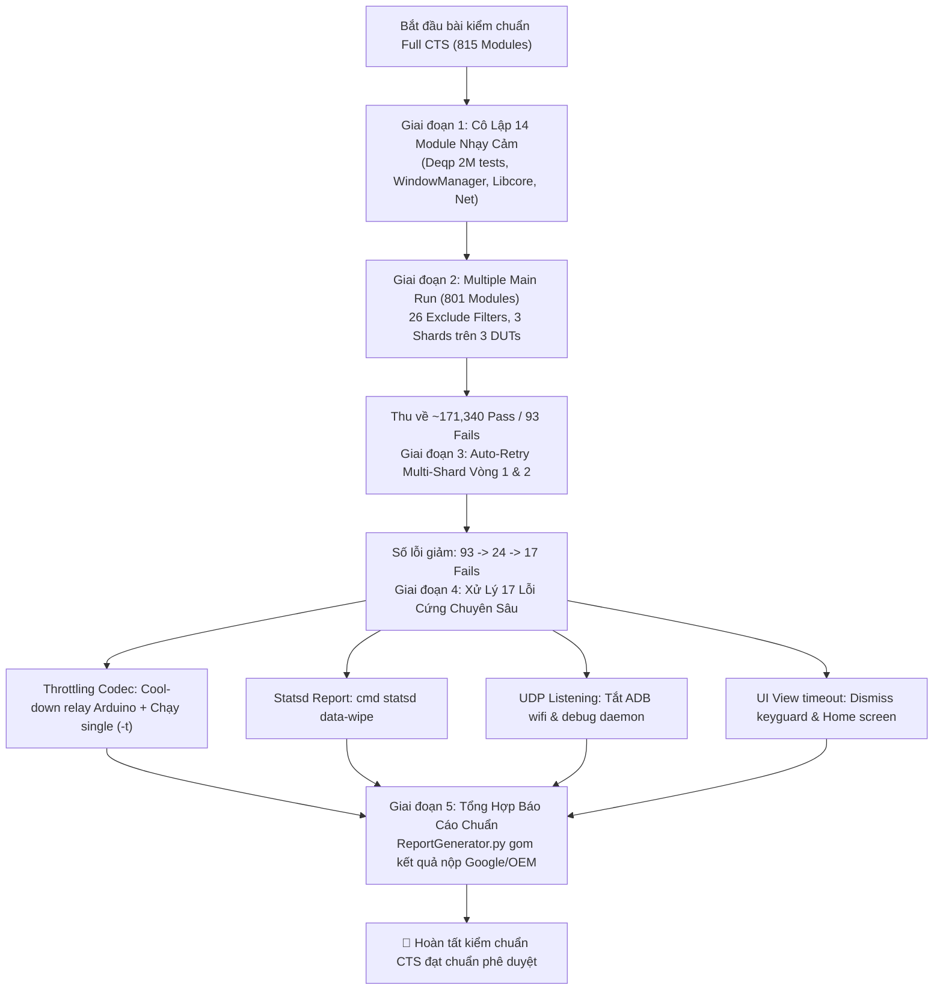

# CTS Full Test Suite (Android Automotive) - Vận Hành & Auto-Retry Pass Toàn Diện

Tài liệu này là cẩm nang chuẩn (Skill) hướng dẫn toàn diện cách thiết lập, khởi chạy, tự động hóa retry và khắc phục các ca lỗi cho bộ kiểm thử **Google CTS (Compatibility Test Suite)** trên nền tảng **Android Automotive OS (Nissan AIVI / Head Unit)**.

Được đúc kết từ thực nghiệm trên **86 sessions kiểm thử thực tế** tại máy chủ `10.218.153.44`, bao phủ toàn bộ **815 modules** và hơn **2,174,000 test cases** (bao gồm cả 2,003,149 bài test đồ họa Vulkan `CtsDeqpTestCases`).

---

## 📑 MỤC LỤC
1. [Bản Chất Full CTS vs CTS on GSI](#1-bản-chất-full-cts-vs-cts-on-gsi)
2. [Cấu Hình Môi Trường, Cụm 3 DUTs & Relay PCB](#2-cấu-hình-môi-trường-cụm-3-duts--relay-pcb)
3. [Checklist Chuẩn Bị Thiết Bị (Pre-conditions)](#3-checklist-chuẩn-bị-thiết-bị-pre-conditions)
4. [Chiến Lược 5 Giai Đoạn Vượt Ải (The 5-Phase Master Plan)](#4-chiến-lược-5-giai-đoạn-vượt-ải-the-5-phase-master-plan)
   - [Giai đoạn 1: Chạy Độc Lập 14 Module Nhạy Cảm (Single Execution)](#giai-đoạn-1-chạy-độc-lập-14-module-nhạy-cảm-single-execution)
   - [Giai đoạn 2: Chạy 801 Module Chính Với 26 Exclude Filters (3 Shards)](#giai-đoạn-2-chạy-801-module-chính-với-26-exclude-filters-3-shards)
   - [Giai đoạn 3: Vòng Lặp Multi-Shard Auto-Retry Hội Tụ](#giai-đoạn-3-vòng-lặp-multi-shard-auto-retry-hội-tụ)
   - [Giai đoạn 4: Xử Lý 17 Lỗi Cứng (Thermal Throttling, Statsd, UDP, UI)](#giai-đoạn-4-xử-lý-17-lỗi-cứng)
   - [Giai đoạn 5: Tổng Hợp Báo Cáo Chuẩn Nộp Google/OEM](#giai-đoạn-5-tổng-hợp-báo-cáo-chuẩn-nộp-googleoem)
5. [Cẩm Nang Tra Cứu Lệnh Tradefed & Điều Khiển Phần Cứng](#5-cẩm-nang-tra-cứu-lệnh-tradefed--điều-khiển-phần-cứng)
6. [Kịch Bản Cho AI Agent Trong Các Phiên Làm Việc Tiếp Theo](#6-kịch-bản-cho-ai-agent-trong-các-phiên-làm-việc-tiếp-theo)
7. [Tài Liệu & Scripts Đi Kèm](#7-tài-liệu--scripts-đi-kèm)

---

## 1. Bản Chất Full CTS vs CTS on GSI

| Đặc Điểm | Full CTS (Bản Này) | CTS on GSI |
| :--- | :--- | :--- |
| **Hệ Điều Hành** | Bản ROM hoàn chỉnh của OEM (Native Firmware tích hợp đầy đủ App, VHAL, CAN stack) | Bản Generic System Image (AOSP thuần) flash đè phân vùng `system` |
| **Quy Mô Kiểm Thử** | **815 modules**, **~2,174,000+ test cases** | 133 modules, ~139,287 test cases |
| **Module Đồ Họa** | `CtsDeqpTestCases` đầy đủ (**2,003,149 test cases** Vulkan & OpenGL) | Rút gọn hoặc chỉ chạy API framework cơ bản |
| **Mục Tiêu Kiểm Chuẩn** | Đạt chứng nhận tương thích toàn diện của Google để phát hành xe thương mại | Kiểm tra tính tuân thủ Project Treble giữa Vendor HAL và AOSP |
| **Chiến Lược Chạy** | Phân tách **Single-Multi Hybrid** (14 Single + 801 Multiple) | Chạy 4 tầng lọc Exclude -> Single -> Retry |

---

## 2. Cấu Hình Môi Trường, Cụm 3 DUTs & Relay PCB

### Máy Chủ & Thư Mục:
- **Server:** `10.218.153.44` (User: `lge` / Password: `lge@1234`)
- **Thư mục Tradefed:** `/home/lge/GoogleQA/TestFolder/CTS_22324141,70b1036,5a9ba6a2/android-cts/`
- **Bộ Test Plan chuẩn:** `/home/lge/Environment/TestPlan/NissanEU_CTS_Plan_Multiple_Single.xlsx`
- **Công cụ AutoRetry:** `/home/lge/Environment/tools/AutoRetry_V1.8_CTS_A14/AutoRetry.sh`
- **Bộ tạo báo cáo:** `/home/lge/Environment/tools/GenerReport_Update_0623/ReportGenerator.py`

### Bản Đồ Cụm 3 Thiết Bị & Relay Arduino:
Hệ thống sử dụng mạch rơ-le Arduino kết nối qua cổng `/dev/arduino` (Baud: 9600) để cấp/ngắt nguồn độc lập cho từng DUT:

| DUT | Serial Number | Cổng Relay | Lệnh Tắt Nguồn | Lệnh Bật Nguồn | Kịch Bản Phục Hồi (Hard Reboot) |
| :---: | :---: | :---: | :---: | :---: | :--- |
| **DUT 1** | `22324141` | Relay 1 | `R1off` | `R1` | `python3 ControlPCB.py R1off && sleep 10 && python3 ControlPCB.py R1` |
| **DUT 2** | `70b1036` | Relay 2 | `R2off` | `R2` | `python3 ControlPCB.py R2off && sleep 10 && python3 ControlPCB.py R2` |
| **DUT 3** | `5a9ba6a2` | Relay 3 | `R3off` | `R3` | `python3 ControlPCB.py R3off && sleep 10 && python3 ControlPCB.py R3` |

---

## 3. Checklist Chuẩn Bị Thiết Bị (Pre-conditions)

Trước khi khởi chạy kiểm thử, chạy script thiết lập pre-conditions cho cả 3 DUT:

```bash
bash .agents/skills/cts-test/scripts/precondition_3duts.sh
```

### Các bước can thiệp qua ADB trên từng máy:
1. **Duy trì màn hình sáng (Stay Awake):**
   `adb -s <serial> shell settings put global stay_on_while_plugged_in 7` và `adb -s <serial> shell svc power stayon true`.
2. **Gỡ bỏ màn hình khóa:**
   `adb -s <serial> shell settings put secure lock_screen_lock_none true` và `adb -s <serial> shell wm dismiss-keyguard`.
3. **Reset độ phân giải hiển thị:**
   `adb -s <serial> shell wm size reset` và `adb -s <serial> shell wm density reset`.
4. **Ngôn ngữ chuẩn:**
   `adb -s <serial> shell 'setprop persist.sys.locale en-US'`.
5. **Dọn sạch hàng đợi sự kiện statsd:**
   `adb -s <serial> shell cmd statsd data-wipe`.

---

## 4. Chiến Lược 5 Giai Đoạn Vượt Ải (The 5-Phase Master Plan)



---

### Giai đoạn 1: Chạy Độc Lập 14 Module Nhạy Cảm (Single Execution)

Chạy riêng biệt 14 module nhạy cảm theo danh sách chuẩn trong `NissanEU_CTS_Plan_Multiple_Single.xlsx`:

```bash
# 1. Đồ họa cực nặng (2,003,149 test cases - chạy ~11 tiếng):
run cts -m CtsDeqpTestCases --shard-count 3 -s 22324141 -s 70b1036 -s 5a9ba6a2

# 2. Quản lý cửa sổ & hiển thị Automotive:
run cts -m CtsWindowManagerDeviceTestCases --shard-count 3

# 3. Thư viện mạng & hệ thống:
run cts -m CtsLibcoreTestCases --shard-count 3
run cts -m CtsNetTestCases --shard-count 3
run cts -m CtsHostsideNetworkTests --shard-count 3

# 4. Telemetry & Quyền:
run cts -m CtsStatsdAtomHostTestCases --shard-count 3
run cts -m CtsAppTestCases --shard-count 3
run cts -m CtsAutoFillServiceTestCases --shard-count 3
run cts -m CtsDevicePolicyTestCases --shard-count 3
run cts -m CtsMultiUserHostTestCases --shard-count 3
run cts -m CtsMultiUserTestCases --shard-count 3
run cts -m CtsDomainVerificationDeviceMultiUserTestCases --shard-count 3
run cts -m CtsAccessibilityServiceTestCases --shard-count 3
run cts -m CtsEdiHostTestCases --no-skip-device-info --shard-count 3
```

---

### Giai đoạn 2: Chạy 801 Module Chính Với 26 Exclude Filters (3 Shards)

Chạy toàn bộ 801 modules còn lại trên 3 thiết bị với lệnh chuẩn:

```bash
run cts \
  --exclude-filter "CtsMediaTestCases" \
  --exclude-filter "CtsMediaTestCases[instant]" \
  --exclude-filter "CtsDeqpTestCases" \
  --exclude-filter "CtsLibcoreTestCases" \
  --exclude-filter "CtsNetTestCases" \
  --exclude-filter "CtsNetTestCases[instant]" \
  --exclude-filter "CtsStatsdAtomHostTestCases" \
  --exclude-filter "CtsStatsdAtomHostTestCases[instant]" \
  --exclude-filter "CtsWindowManagerDeviceTestCases" \
  --exclude-filter "CtsHostsideNetworkTests" \
  --exclude-filter "CtsHostsideNetworkTests[instant]" \
  --exclude-filter "CtsCarTestCases" \
  --exclude-filter "CtsAppTestCases" \
  --exclude-filter "CtsAppTestCases[instant]" \
  --exclude-filter "CtsAutoFillServiceTestCases" \
  --exclude-filter "CtsAutoFillServiceTestCases[instant]" \
  --exclude-filter "CtsDomainVerificationDeviceMultiUserTestCases" \
  --exclude-filter "CtsDevicePolicyTestCases" \
  --exclude-filter "CtsMultiUserHostTestCases" \
  --exclude-filter "CtsMultiUserTestCases" \
  --exclude-filter "CtsEdiHostTestCases" \
  --exclude-filter "CtsAccessibilityServiceTestCases" \
  --exclude-filter "CtsAccessibilityServiceTestCases[instant]" \
  --exclude-filter "CtsDevicePolicyTestCases[run-on-clone-profile]" \
  --exclude-filter "CtsDevicePolicyTestCases[run-on-secondary-user]" \
  --exclude-filter "CtsDevicePolicyTestCases[run-on-work-profile]" \
  --shard-count 3 -s 22324141 -s 70b1036 -s 5a9ba6a2
```
- **Kết quả thực tế (Session 7):** Đạt **171,340 Pass, 93 Fail** (Hoàn thành 813/815 modules an toàn tuyệt đối).

---

### Giai đoạn 3: Vòng Lặp Multi-Shard Auto-Retry Hội Tụ

Thực hiện retry liên tiếp 2 vòng có phân chia shards:
1. **Vòng Retry 1:**
   ```bash
   run retry --retry <session_baseline_id> --retry-type FAILED --shard-count 3 -s 22324141 -s 70b1036 -s 5a9ba6a2
   ```
   *Kết quả thực tế:* Số lỗi giảm từ **93 xuống 24 Fails** (Session 8).
2. **Vòng Retry 2:**
   ```bash
   run retry --retry <session_retry1_id> --retry-type FAILED --shard-count 3 -s 22324141 -s 70b1036 -s 5a9ba6a2
   ```
   *Kết quả thực tế:* Số lỗi giảm từ **24 xuống 17 Fails** (Session 9).

---

### Giai đoạn 4: Xử Lý 17 Lỗi Cứng

Khi danh sách lỗi chạm ngưỡng 17 ca, **dừng ngay việc retry đa shard** và áp dụng giải pháp chuyên sâu cho từng ca:

#### 1. Lỗi Hạ Xung Codec Do Quá Nhiệt (Thermal Throttling)
- **Module:** `CtsVideoTestCases`, `CtsMediaDecoderTestCases`
- **Hiện tượng:** FPS đạt 218 thay vì 226 tối thiểu.
- **Giải pháp:**
  1. Ngắt nguồn relay để hạ nhiệt độ SoC:
     ```bash
     python3 /home/lge/Environment/scripts/ControlPCB.py R1off
     sleep 600  # Cho máy nghỉ 10 phút
     python3 /home/lge/Environment/scripts/ControlPCB.py R1
     ```
  2. Chạy single test case:
     ```bash
     run cts -m CtsVideoTestCases -t android.video.cts.VideoEncoderDecoderTest#testPerf[video/x-vnd.on2.vp8_c2.qti.vp8.encoder_320x180_0] -s 22324141
     ```
  3. **Kết quả:** Đo đạt 235 FPS -> **PASS 100%** (Session `2026.09.14_16.47.16`).

#### 2. Lỗi Bộ Đệm Statsd Log Report
- **Module:** `CtsAppCompatHostTestCases[instant]`
- **Mã lỗi:** `Failed to fetch and parse the statsd output report`.
- **Giải pháp:**
  ```bash
  adb -s <serial> shell cmd statsd data-wipe
  run retry --retry <sess_id> -s <serial> --include-filter "CtsAppCompatHostTestCases[instant]"
  ```

#### 3. Lỗi Màn Hình Khóa & UI Không Tìm Thấy View
- **Module:** `CtsPermission3TestCases`, `CtsWindowManagerDeviceTestCases`
- **Mã lỗi:** `View not found after waiting for 20000ms`.
- **Giải pháp:**
  ```bash
  adb -s <serial> shell wm dismiss-keyguard
  adb -s <serial> shell input keyevent 224
  adb -s <serial> shell input keyevent 3
  ```

#### 4. Lỗi Cổng Nghe UDP Không An Toàn
- **Module:** `CtsAppSecurityHostTestCases` (`testNoRemotelyAccessibleListeningUdpPorts`)
- **Giải pháp:** Tắt debug over Wi-Fi (`adb tcpip`), chỉ kết nối cáp USB Type-C vật lý.

---

### Giai đoạn 5: Tổng Hợp Báo Cáo Chuẩn Nộp Google/OEM

Sau khi các session đơn lẻ và main suite đã hoàn tất với kết quả tốt nhất, kích hoạt công cụ hợp nhất báo cáo:

```bash
python3 /home/lge/Environment/tools/GenerReport_Update_0623/ReportGenerator.py -p /home/lge/GoogleQA/P33B_26MY/03.REPORT/01.Full/
```
Công cụ tự động trích xuất các lượt chạy có kết quả cao nhất trong `results/`, loại bỏ các ca fail đã được retry pass, và tạo ra 3 bộ thư mục:
- `Internal/`: Báo cáo kỹ thuật chi tiết.
- `OemApfe/`: Báo cáo tóm lược gửi OEM xe hơi.
- `OemApfeUpload/`: Các file `.zip` hoàn chỉnh chuẩn bị nộp cho Google Partner.

---

## 5. Cẩm Nang Tra Cứu Lệnh Tradefed & Điều Khiển Phần Cứng

### Lệnh Tradefed Console Thường Dùng:
| Thao Tác | Lệnh Console |
| :--- | :--- |
| Xem danh sách kết quả | `l r` hoặc `list results` |
| Xem danh sách thiết bị | `l d` hoặc `list devices` |
| Xem tiến trình test đang chạy | `l i` hoặc `list invocations` |
| Chạy lại toàn bộ fail của session | `run retry --retry <sess_id> --retry-type FAILED --shard-count 3` |
| Chạy riêng 1 module cho session | `run retry --retry <sess_id> -s <serial> --include-filter <ModuleName>` |
| Chạy đích danh 1 method cụ thể | `run cts -m <Module> -t <Class>#<Method> -s <serial>` |

### Lệnh Điều Khiển Relay Nguồn Arduino:
| Tác Vụ | Lệnh Shell |
| :--- | :--- |
| Tắt nguồn DUT 1 (`22324141`) | `python3 ControlPCB.py R1off` |
| Bật nguồn DUT 1 (`22324141`) | `python3 ControlPCB.py R1` |
| Tắt nguồn DUT 2 (`70b1036`) | `python3 ControlPCB.py R2off` |
| Bật nguồn DUT 2 (`70b1036`) | `python3 ControlPCB.py R2` |
| Tắt nguồn DUT 3 (`5a9ba6a2`) | `python3 ControlPCB.py R3off` |
| Bật nguồn DUT 3 (`5a9ba6a2`) | `python3 ControlPCB.py R3` |

---

## 6. Kịch Bản Cho AI Agent Trong Các Phiên Làm Việc Tiếp Theo

Khi người dùng yêu cầu liên quan đến **Full CTS trên Nissan AIVI** (ví dụ: *"Chạy test CTS"*, *"Kiểm tra tiến độ retry CTS"*, *"Xử lý các ca fail của CTS trên máy 10.218.153.44"*), Agent thực hiện theo quy trình 4 bước:

1. **Bước 1: Khám Phá & Đánh Giá Tình Trạng Hiện Tại**
   - Kết nối SSH vào `10.218.153.44`.
   - Kiểm tra `adb devices -l` đảm bảo đủ 3 thiết bị (`22324141`, `70b1036`, `5a9ba6a2`).
   - Quét thư mục `android-cts/results/` để xác định session gần nhất và số lỗi hiện tại.

2. **Bước 2: Chuẩn Bị & Phục Hồi Thiết Bị (Nếu Có Treo/Throttling)**
   - Nếu thiết bị có dấu hiệu nóng hoặc treo ADB: Sử dụng lệnh Relay PCB (`R1off`, `R2off`, `R3off`) để power-cycle và cho thiết bị hạ nhiệt.
   - Chạy script `precondition_3duts.sh` để cấu hình Stay Awake, Unlock và Wipe Statsd.

3. **Bước 3: Lựa Chọn Lệnh Khởi Chạy Tương Ứng**
   - Nếu chạy mới hoàn toàn $\rightarrow$ Thực hiện Giai đoạn 1 (14 Single modules) rồi đến Giai đoạn 2 (801 modules).
   - Nếu số lỗi > 20 $\rightarrow$ Chạy Giai đoạn 3 (Multi-shard retry trên cả 3 DUTs).
   - Nếu số lỗi < 20 $\rightarrow$ Chuyển sang Giai đoạn 4, gom về 1 DUT ổn định nhất hoặc chạy đích danh với cờ `-t`.

4. **Bước 4: Tổng Hợp & Đóng Gói Kết Quả**
   - Chạy `ReportGenerator.py` để xuất báo cáo cuối cùng vào `/home/lge/GoogleQA/P33B_26MY/03.REPORT/01.Full/`.
   - Báo cáo chi tiết số liệu Pass/Fail cho người dùng.

---

## 7. Tài Liệu & Scripts Đi Kèm

- [Phân Tích 86 Sessions Thực Chiến CTS](./references/86_sessions_case_study.md)
- [Kiến Trúc Kế Hoạch Single-Multi Plan](./references/single_multi_plan_architecture.md)
- [Phần Cứng Cụm 3 DUTs & Relay Arduino PCB](./references/nissan_cts_hardware_relay.md)
- [Script: control_relay_pcb.py](./scripts/control_relay_pcb.py)
- [Script: precondition_3duts.sh](./scripts/precondition_3duts.sh)
- [Script: generate_full_cts_report.py](./scripts/generate_full_cts_report.py)
