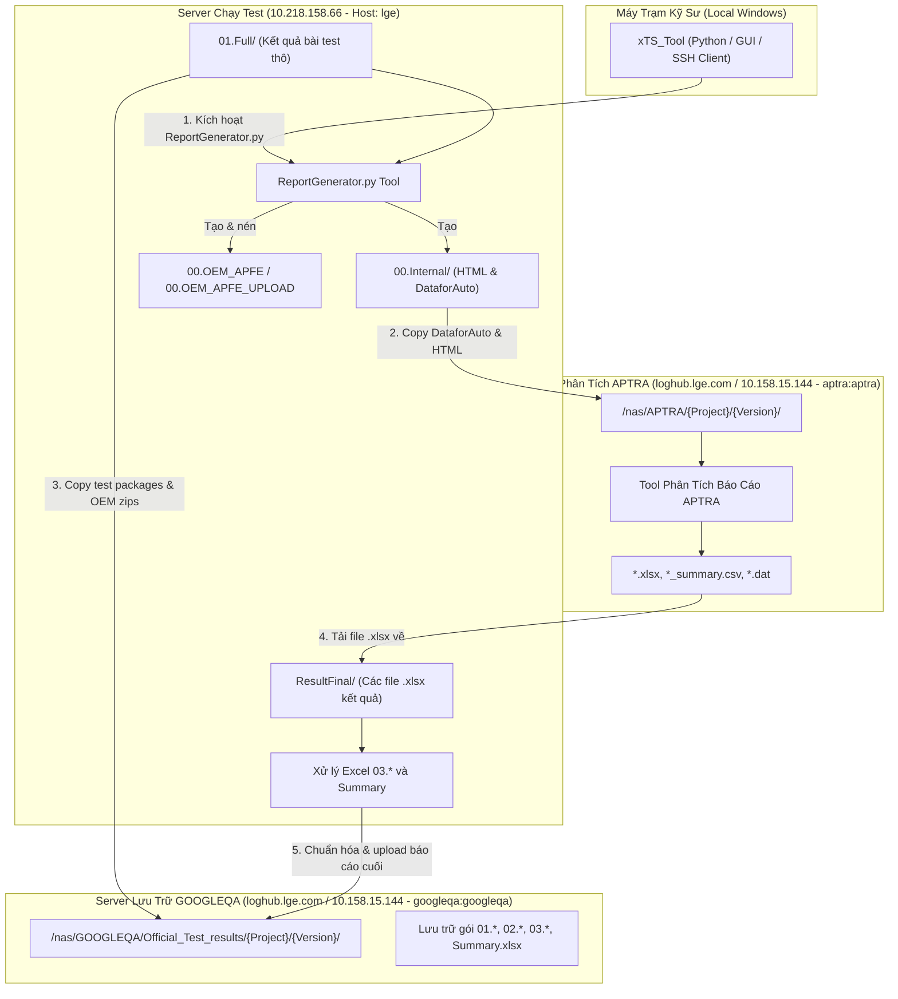

# Tài Liệu Quy Trình Tự Động Hóa Báo Cáo xTS (Generate Report Workflow)

## 1. Giới thiệu tổng quan
Tài liệu này mô tả toàn bộ quy trình từ đầu đến cuối (End-to-End Pipeline) của tính năng **Generate Report** cho các bài test Google Certification xTS (Android Automotive OS) trên dự án Nissan AIVI.
Quy trình này tích hợp luồng xử lý đa máy chủ (Multi-Server Orchestration), chuyển đổi định dạng báo cáo, trích xuất dữ liệu bài test, xử lý và làm sạch bảng tính Excel tự động, và phát hành gói báo cáo chính thức lên server lưu trữ GOOGLEQA.

---

## 2. Kiến trúc hạ tầng hệ thống (Infrastructure Topology)

Quy trình bao gồm sự tương tác giữa 4 thực thể máy chủ và client:

### Thông tin kết nối các máy chủ:
| Server | Địa chỉ / Hostname | Port | Username / Password | Vai trò chính |
| :--- | :--- | :---: | :--- | :--- |
| **Test Runner Server** | `10.218.158.66` | 22 | `lge` / `lge@1234` | Chạy test xTS, lưu kết quả thô, chạy `ReportGenerator.py`, xử lý file Excel `03.` và `Summary`. |
| **APTRA Analysis Server** | `loghub.lge.com` (`10.158.15.144`) | 22 | `aptra` / `aptra` | Chạy tool phân tích từ XML/HTML nội bộ sang các file `.xlsx`, `.csv`, `.dat`. Đường dẫn gốc: `/nas/APTRA/`. |
| **GOOGLEQA Storage Server** | `loghub.lge.com` (`10.158.15.144`) | 22 | `googleqa` / `googleqa` | Lưu trữ chính thức kết quả test chứng chỉ Google phục vụ audit và release. Đường dẫn gốc: `/nas/GOOGLEQA/Official_Test_results/`. |
| **Local Client** | Windows Host (`D:\Training\Guide\YAK`) | - | - | Chạy công cụ điều khiển `xTS_Tool`. |

---

## 3. Tóm tắt các giai đoạn chính (Pipeline Phases)

1. **Giai đoạn 1: Chuẩn bị & Tiền xử lý (Pre-processing on Server 66)**
   - Đầu vào: Thư mục `/home/lge/GoogleQA/Report_tmp/01.Full/` chứa kết quả chạy test của các bộ test suite (ATS, CTS, STS, VTS, CTSonGSI, BFG, AtsInteractive, AtsMultidevice, CTS_Verifier).
   - Chạy tool `ReportGenerator.py` để tạo cấu trúc `00.Internal`, `00.OEM_APFE`, `00.OEM_APFE_UPLOAD` và nén các folder test thành file `.zip`.

2. **Giai đoạn 2: Đồng bộ dữ liệu lên Server lưu trữ và Server phân tích (Data Sync)**
   - Upload toàn bộ các folder và zip trong `01.Full/` cùng 2 file zip `00.OEM_APFE.zip`, `00.OEM_APFE_UPLOAD.zip` lên server **GOOGLEQA**.
   - Copy các thư mục kết quả trong `00.Internal/` (chứa các file HTML và thư mục `DataforAuto/` có chứa XML test results) sang server **APTRA**.

3. **Giai đoạn 3: Phân tích & Trích xuất số liệu trên APTRA (APTRA Analysis)**
   - Tool trên APTRA xử lý các file XML để tổng hợp số liệu test case, sinh ra:
     - Các file Excel kết quả chi tiết từng bộ test: `ATSResult.xlsx`, `CTSResult.xlsx`, `BFGResult.xlsx`, `STSResult.xlsx`, `CTSonGSIResult.xlsx`, ...
     - File tóm tắt chỉ số: `<Version>_summary.csv`.
     - Các file dữ liệu: `<Version>_defect.dat`, `<Version>_pass.dat`, `<Version>_pass_tc.dat`.

4. **Giai đoạn 4: Thu thập & Chuẩn hóa file kết quả chi tiết `03.` (Format Final Suite Reports)**
   - Tải toàn bộ các file `.xlsx` từ APTRA về thư mục tạm `/home/lge/GoogleQA/Report_tmp/ResultFinal/` trên Server 66.
   - Đổi tên file theo đúng chuẩn: `03.LGE_{Model}_{Suite}_Result_Final_{SW_Version}.xlsx`.
   - Mở từng file `.xlsx`, điền thông tin Header (HW version, SW version, MICOM version, Project, OEM Delivery, Test Start, Test End, Tester).
   - Unmerge và xóa bỏ toàn bộ các dòng ghi chú hướng dẫn nội bộ (dòng 15 đến 40), chỉ giữ lại bảng thông tin và thống kê sạch sẽ (hàng 1 - 14).

5. **Giai đoạn 5: Tổng hợp file Certification Summary (Generate Google Certification Summary)**
   - Tải file Summary mẫu của version trước từ GOOGLEQA về làm cơ sở.
   - Kiểm tra và copy khối bảng của version trước, paste tạo khối bảng cho version mới tại sheet `Summary`.
   - Trích xuất 7 chỉ số kiểm thử (`Pass`, `Fail`, `Assumption Failure`, `Ignored`, `Total Tests`, `Module Done`, `Total Module`) từ sheet `Test Result_Detail` (dòng 3) của từng file suite `03.` để điền vào sheet `Summary`.
   - Nếu có bộ test có `Fail > 0`:
     - Lọc các module có `Failed > 0` tại sheet `Test Result_Detail` và ghi vào sheet **`Nissan Fail Module List`**.
     - Trích xuất danh sách các test case fail cụ thể từ sheet `Failed Test Cases` và ghi vào sheet **`Nissan Fail TestCase List`**.
   - Nếu không có lỗi (`Fail = 0` toàn bộ): Giữ nguyên khung bảng của 2 sheet trên và để trống phần data.

6. **Giai đoạn 6: Xuất bản và lưu trữ chính thức (Official Publishing)**
   - Upload toàn bộ các file `03.*.xlsx` đã chuẩn hóa và file `Nissan_{Model}_Google Certification Summary_{Version}.xlsx` lên thư mục phát hành chính thức trên server GOOGLEQA.
