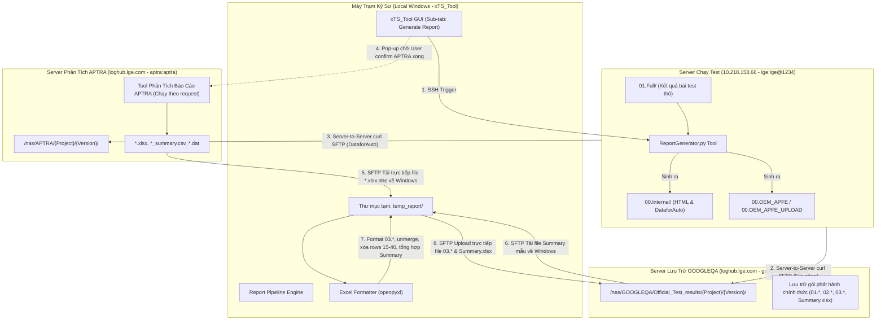

# Tổng Quan Quy Trình Tự Động Hóa Báo Cáo xTS (Generate Report Workflow)

## 1. Giới thiệu tổng quan
Tài liệu này mô tả toàn bộ kiến trúc và quy trình từ đầu đến cuối (End-to-End Pipeline) của tính năng **Generate Report** cho các bài test Google Certification xTS (Android Automotive OS) trên dự án Nissan AIVI.
Quy trình này tích hợp luồng xử lý đa máy chủ (Multi-Server Orchestration), chuyển đổi định dạng báo cáo, trích xuất dữ liệu bài test, xử lý và làm sạch bảng tính Excel tự động trên máy trạm Windows bằng `openpyxl`, và phát hành gói báo cáo chính thức lên server lưu trữ GOOGLEQA.

---

## 2. Kiến trúc hạ tầng hệ thống (Infrastructure Topology)

### Thông tin kết nối các máy chủ:
| Server | Địa chỉ / Hostname | Port | Username / Password | Vai trò chính |
| :--- | :--- | :---: | :--- | :--- |
| **Test Runner Server** | `10.218.158.66` | 22 | `lge` / `lge@1234` | Chạy test xTS, lưu kết quả thô `01.Full/`, chạy `ReportGenerator.py`. |
| **APTRA Analysis Server** | `loghub.lge.com` (`10.158.15.144`) | 22 | `aptra` / `aptra` | Chạy tool phân tích từ XML/HTML nội bộ sang các file `.xlsx`, `.csv`, `.dat`. Đường dẫn: `/nas/APTRA/`. |
| **GOOGLEQA Storage Server** | `loghub.lge.com` (`10.158.15.144`) | 22 | `googleqa` / `googleqa` | Lưu trữ chính thức kết quả test chứng chỉ Google phục vụ audit và release. Đường dẫn: `/nas/GOOGLEQA/Official_Test_results/`. |
| **Local Client** | Windows Host (`D:\Training\Guide\YAK`) | - | - | Chạy công cụ điều khiển `xTS_Tool`, xử lý logic Excel `openpyxl`. |

---

## 3. Tối ưu hóa truyền dữ liệu & xử lý Excel (Key Architectural Decisions)

1. **Truyền dữ liệu lớn trực tiếp giữa các Server Linux (Server-to-Server):**
   - Các file nặng (vài trăm MB đến hàng GB như `01.CTS.zip`, `00.OEM_APFE*.zip`, `00.Internal/*Results`) được copy trực tiếp giữa Server 66 và Server APTRA/GOOGLEQA qua giao thức SFTP của lệnh `curl` trên mạng LAN 10.x. Tốc độ đạt ~50-80 MB/s, tránh làm nghẽn mạng máy trạm cá nhân.
2. **Xử lý Excel trực tiếp trên Windows Client (`openpyxl`):**
   - Các file `.xlsx` kết quả và file Summary rất nhẹ (chỉ ~50KB - 80KB mỗi file, tổng cộng dưới 1MB).
   - `xTS_Tool` tải trực tiếp các file này về thư mục tạm `temp_report/` trên máy tính Windows, thực hiện toàn bộ logic định dạng, tính toán bằng `openpyxl` cực nhanh (dưới 1 giây).
   - Upload thẳng các file hoàn thiện lên GOOGLEQA, không cần trung chuyển qua Server 66, không phụ thuộc môi trường Python của server.
