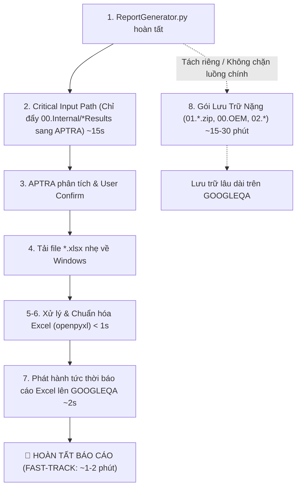

# Các Điểm Lưu Ý Sống Còn & Xử Lý Biên Thực Tế (Critical Notes & Edge Cases)

> **Tài liệu bổ sung chuyên sâu:** Tổng hợp toàn bộ các phát hiện kỹ thuật, trường hợp ngoại lệ (edge cases), các bẫy logic và bài học kinh nghiệm thực tế trong quá trình phát triển, kiểm thử và bàn giao tính năng **Generate Report** trên hệ thống Nissan AIVI (đặc biệt là các điểm mà tài liệu đặc tả ban đầu / file docx chưa đề cập hoặc mô tả chưa đầy đủ).

---

## 📑 Mục Lục

1. [Đồng Bộ Động Phiên Bản Test Suite Vào Cột Test Category (Sheet Summary)](#1-đồng-bộ-động-phiên-bản-test-suite-vào-cột-test-category-sheet-summary)
2. [Quy Tắc Đặt Tên File Summary Đầu Ra (Tránh Giữ Tên Version Cũ)](#2-quy-tắc-đặt-tên-file-summary-đầu-ra-tránh-giữ-tên-version-cũ)
3. [Cập Nhật SW Version Vào Header Khối Bảng Mới (Sheet Summary)](#3-cập-nhật-sw-version-vào-header-khối-bảng-mới-sheet-summary)
4. [Điền SW Version Vào Ô C5 Của Toàn Bộ File 03.*.xlsx](#4-điền-sw-version-vào-ô-c5-của-toàn-bộ-file-03xlsx)
5. [Chuẩn Hóa Ánh Xạ Tên 10 Bộ Test Suite (APTRA -> 03.* -> Summary)](#5-chuẩn-hóa-ánh-xạ-tên-10-bộ-test-suite-aptra---03---summary)
6. [Thuật Toán Trích Xuất 7 Chỉ Số Kiểm Thử & Cơ Chế Fallback Tính Toán](#6-thuật-toán-trích-xuất-7-chỉ-số-kiểm-thử--cơ-chế-fallback-tính-toán)
7. [Xử Lý Riêng Biệt Cho Bộ Test CTS-Verifier (XML Direct Parser)](#7-xử-lý-riêng-biệt-cho-bộ-test-cts-verifier-xml-direct-parser)
8. [Quy Tắc Làm Sạch & Ghi Dữ Liệu Hai Sheet Lỗi (Fail Lists)](#8-quy-tắc-làm-sạch--ghi-dữ-liệu-hai-sheet-lỗi-fail-lists)
9. [Hỗ Trợ Đa Máy Chủ Runner & Đường Dẫn 01.Full Tùy Biến](#9-hỗ-trợ-đa-máy-chủ-runner--đường-dẫn-01full-tùy-biến)
10. [Xử Lý Khi Chạy Không Đầy Đủ Bài Test (Partial Test Runs)](#10-xử-lý-khi-chạy-không-đầy-đủ-bài-test-partial-test-runs)
11. [Kỹ Thuật Làm Sạch Hàng 15–40 và Tránh Hỏng File Excel Do Unmerge](#11-kỹ-thuật-làm-sạch-hàng-1540-và-tránh-hỏng-file-excel-do-unmerge)
12. [Bảo Toàn Định Dạng Ngày Tháng (Date String) & Công Thức Tỷ Lệ Pass](#12-bảo-toàn-định-dạng-ngày-tháng-date-string--công-thức-tỷ-lệ-pass)
13. [Tách Biệt Luồng Báo Cáo Nhanh (Fast-Track) Khỏi Gói Lưu Trữ Nặng (Heavy Archives)](#13-tách-biệt-luồng-báo-cáo-nhanh-fast-track-khỏi-gói-lưu-trữ-nặng-heavy-archives)

---

## 1. Đồng Bộ Động Phiên Bản Test Suite Vào Cột Test Category (Sheet Summary)

### ⚠️ Vấn đề trong docx / tài liệu cũ:
- Tài liệu ban đầu chỉ hiển thị mẫu bảng cứng với các phiên bản cố định của kỳ test trước, ví dụ: `CTS (14_r12)`, `STS (sts-r54)`, `VTS` (không có version), `ATS (2026_r2)`, `CTS-Verifier (14_r12)`.
- Ban đầu một số quan điểm cho rằng chỉ cần giữ nguyên mẫu hoặc chỉ cập nhật version cho một vài bộ test chính (CTS, CTSonGSI, STS, VTS, ATS), còn các bộ test khác (KR/EU) thì giữ nguyên.
- **Hậu quả thực tế:** Khi chạy sang SW version mới (ví dụ `YAK.31.04.10`), các bộ test sử dụng tool bản mới hơn (như CTS `14_r13`, STS `14_sts-r55`), nhưng bảng Summary vẫn in version cũ `14_r12` hoặc giữ nguyên mẫu cũ, gây sai lệch báo cáo audit chứng chỉ Google.

### ✅ Quy chuẩn kỹ thuật chuẩn hóa:
1. **Áp dụng cho TOÀN BỘ 10 Test Suite trong bảng Summary**, không ngoại lệ.
2. **Nguồn lấy Version thực tế:**
   - **Đối với 9 bộ test thông thường:** Trích xuất từ **ô C7** (trường `Test Suite`) trên sheet `Test Summary` của chính file `03.*.xlsx` tương ứng.
     - Ô C7 chứa chuỗi dạng: `CTS 14_r13`, `STS 14_sts-r55`, `VTS 14_r13`, `ATS 2026_r2`.
     - Tool sử dụng hàm `extract_suite_version_from_c7()` bóc tách bỏ tiền tố tên suite để lấy phần phiên bản sạch:
       - `CTS 14_r13` $\rightarrow$ `14_r13`
       - `STS 14_sts-r55` $\rightarrow$ `14_sts-r55`
       - `VTS 14_r13` $\rightarrow$ `14_r13`
       - `ATS 2026_r2` $\rightarrow$ `2026_r2`
   - **Đối với `CTS-Verifier`:** Lấy trực tiếp từ thuộc tính `suite_version` của thẻ `<Result>` trong file `cts_verifier_result.xml` (ví dụ `suite_version="14_r13"` $\rightarrow$ `14_r13`).
3. **Định dạng hiển thị tại Cột C (Test Category):**
   - Giữ nguyên Tên gốc (Base Name) của từng bộ test (bằng cách cắt bỏ phần ngoặc đơn cũ nếu có: `cell_val.split("(")[0].strip()`).
   - Ghép thành: `f"{base_suite_name} ({ver_str})"`.

| Dòng | Test Category trong Template cũ | Giá trị C7 / XML bóc tách | Kết quả chính thức trong Summary mới |
| :---: | :--- | :--- | :--- |
| 23 | `ATS (2026_r2)` | `2026_r2` | **`ATS (2026_r2)`** |
| 24 | `ATS-In-Car (2026_r2)` | `2026_r2` | **`ATS-In-Car (2026_r2)`** |
| 25 | `ATS_Interactive (2026_r2)` | `2026_r2` | **`ATS_Interactive (2026_r2)`** |
| 26 | `ATS-Multidevice (2026_r2)` | `2026_r2` | **`ATS-Multidevice (2026_r2)`** |
| 27 | `BFG (2026_r2)` | `2026_r2` | **`BFG (2026_r2)`** |
| 28 | `CTS (14_r12)` | `14_r13` | **`CTS (14_r13)`** |
| 29 | `CTSonGSI (14_r12)` | `14_r13` | **`CTSonGSI (14_r13)`** |
| 30 | `STS (sts-r54)` | `14_sts-r55` | **`STS (14_sts-r55)`** |
| 31 | `VTS` | `14_r13` | **`VTS (14_r13)`** |
| 32 | `CTS-Verifier (14_r12)` | `14_r13` | **`CTS-Verifier (14_r13)`** |

---

## 2. Quy Tắc Đặt Tên File Summary Đầu Ra (Tránh Giữ Tên Version Cũ)

### ⚠️ Vấn đề trong docx / tài liệu cũ:
- Tài liệu chỉ đề cập tải file Summary mẫu từ GOOGLEQA về.
- Khi tải file mẫu về (ví dụ file `Nissan_PZ1D_Google Certification Summary_31.03.30.xlsx`), nếu tool không format lại tên file đầu ra mà ghi đè vào file cùng tên, file phát hành sinh ra vẫn mang đuôi `31.03.30` dù dữ liệu bên trong là của bản `31.04.10`.

### ✅ Quy chuẩn kỹ thuật chuẩn hóa:
- Tên file Summary đầu ra **BẮT BUỘC** phải được tính toán dựa trên `model_code` và `short_sw` của phiên bản phần mềm mới đang test:
  ```python
  # Tách short_sw từ sw_version:
  # Ví dụ: "YAK.31.04.10" -> short_sw = "31.04.10"
  parts = sw_version.split(".")
  short_sw = ".".join(parts[1:]) if len(parts) > 1 else sw_version
  summary_fname = f"Nissan_{model_code}_Google Certification Summary_{short_sw}.xlsx"
  ```
- File template tải về được đổi tên lưu tạm là `template_summary.xlsx` trong thư mục làm việc, và file kết quả hoàn chỉnh được lưu với tên mới:
  `Nissan_PZ1D_Google Certification Summary_31.04.10.xlsx`.

---

## 3. Cập Nhật SW Version Vào Header Khối Bảng Mới (Sheet Summary)

### ⚠️ Vấn đề trong docx / tài liệu cũ:
- Khi duplicate khối bảng từ kỳ test trước (ví dụ khối hàng 6–16 duplicate xuống hàng 23–33), việc sao chép ô cell copy cả giá trị cũ:
  - Dòng `SW version` (cột C, dòng thứ 2 của khối bảng mới, vd: Row 20) mặc định mang giá trị `YAK.31.03.30`.
- Tài liệu cũ không nhấn mạnh bước ghi đè giá trị này, dẫn đến bảng tạo ra có kết quả test của `31.04.10` nhưng dòng SW version lại ghi `31.03.30`.

### ✅ Quy chuẩn kỹ thuật chuẩn hóa:
Ngay sau khi duplicate cấu trúc khối bảng và merge cells, Tool bắt buộc cập nhật 3 ô metadata của khối mới:
```python
hw_row = new_block_start         # Row 19: Cột C = metadata["hw_version"] ("C")
sw_row = new_block_start + 1     # Row 20: Cột C = metadata["sw_version"] ("YAK.31.04.10")
micom_row = new_block_start + 2  # Row 21: Cột C = metadata["micom_version"] ("v3.27.37")

ws_sum.cell(hw_row, 3, metadata.get("hw_version", "C"))
ws_sum.cell(sw_row, 3, metadata.get("sw_version", ""))
ws_sum.cell(micom_row, 3, metadata.get("micom_version", "v3.27.37"))
```

---

## 4. Điền SW Version Vào Ô C5 Của Toàn Bộ File `03.*.xlsx`

### ⚠️ Vấn đề trong docx / tài liệu cũ:
- Trong tài liệu mô tả header sheet `Test Summary` của từng file suite `03.*.xlsx`:
  - `C3`: Project (Model) Full
  - `C4`: HW (PCB) version
  - `C5`: SW version
  - `C6`: MICOM version
- Trong quá trình chạy thực tế, ô `C5` đôi khi bị bỏ trống hoặc mang dữ liệu mặc định của tool APTRA sinh ra mà không được update thành SW version mới nhất (`YAK.31.04.10`).

### ✅ Quy chuẩn kỹ thuật chuẩn hóa:
Trong hàm `format_single_suite_report()`, đảm bảo cập nhật đầy đủ và chính xác tất cả các ô trong khối Header:
```python
ws_sum["C3"] = metadata.get("model_full", "")
ws_sum["C4"] = metadata.get("hw_version", "")
ws_sum["C5"] = metadata.get("sw_version", "")      # BẮT BUỘC: YAK.31.04.10
ws_sum["C6"] = metadata.get("micom_version", "")
ws_sum["G2"] = metadata.get("oem_delivery_date", "")
ws_sum["G3"] = metadata.get("test_start_date", "")
ws_sum["G4"] = metadata.get("test_end_date", "")
ws_sum["G6"] = metadata.get("tester_name", "")
```

---

## 5. Chuẩn Hóa Ánh Xạ Tên 10 Bộ Test Suite (APTRA -> `03.*` -> Summary)

### ⚠️ Vấn đề trong docx / tài liệu cũ:
- Tài liệu gốc thường chỉ liệt kê các bài test chung (`ATS`, `CTS`, `STS`, `VTS`) mà không làm rõ sự khác biệt giữa:
  1. Tên folder test thô trong `01.Full/`.
  2. Tên file Excel thô do APTRA sinh ra (`*Result.xlsx` vs `*Results.xlsx`).
  3. Tên file chuẩn hóa `03.*.xlsx`.
  4. Tên dòng Test Category trong bảng Summary.
- **Các lỗi thường gặp:**
  - `AtsIncar`: APTRA sinh ra `AtsIncarResult.xlsx` hoặc `AtsIncarResults.xlsx`. Tên file 03 là `..._AtsIncar_Result_...`, tên trên Summary là `ATS-In-Car`.
  - `AtsInteractive`: APTRA sinh `AtsInteractiveResults.xlsx`. Trên Summary có dấu gạch dưới: `ATS_Interactive`.
  - `AtsMultidevice`: APTRA sinh `AtsMultideviceResults.xlsx`. Trên Summary có dấu gạch ngang: `ATS-Multidevice`.
  - Nếu so khớp chuỗi đơn giản bằng `in` (ví dụ `"ats" in filename`), file `AtsIncar` hoặc `AtsInteractive` sẽ bị nhận nhầm là `ATS`!

### ✅ Bảng ánh xạ chuẩn 10 bộ test:

| STT | Folder trong `01.Full/` | File APTRA sinh ra | File chuẩn hóa `03.*.xlsx` | Dòng trong sheet `Summary` |
| :---: | :--- | :--- | :--- | :--- |
| 1 | `01.ATS` | `ATSResult(s).xlsx` | `03.LGE_..._ATS_Result_Final_{SW}.xlsx` | `ATS (2026_r2)` |
| 2 | `01.AtsInCar` | `AtsIncarResult(s).xlsx` | `03.LGE_..._AtsIncar_Result_{SW}.xlsx` | `ATS-In-Car (2026_r2)` |
| 3 | `01.AtsInteractive` | `AtsInteractiveResults.xlsx` | `03.LGE_..._AtsInteractive_Result_Final_{SW}.xlsx` | `ATS_Interactive (2026_r2)` |
| 4 | `01.AtsMultidevice` | `AtsMultideviceResults.xlsx` | `03.LGE_..._AtsMultidevice_Result_Final_{SW}.xlsx` | `ATS-Multidevice (2026_r2)` |
| 5 | `01.BFG` | `BFGResult(s).xlsx` | `03.LGE_..._BFG_Result_Final_{SW}.xlsx` | `BFG (2026_r2)` |
| 6 | `01.CTS` | `CTSResult(s).xlsx` | `03.LGE_..._CTS_Result_Final_{SW}.xlsx` | `CTS (14_r13)` |
| 7 | `01.CTSonGSI` | `CTSonGSIResult(s).xlsx` | `03.LGE_..._CTSonGSI_Result_Final_{SW}.xlsx` | `CTSonGSI (14_r13)` |
| 8 | `01.STS` | `STSResult(s).xlsx` | `03.LGE_..._STS_Result_Final_{SW}.xlsx` | `STS (14_sts-r55)` |
| 9 | `01.VTS` | `VTSResult(s).xlsx` | `03.LGE_..._VTS_Result_Final_{SW}.xlsx` | `VTS (14_r13)` |
| 10| `01.CTS_Verifier` | *(Không qua APTRA)* | *(Trích xuất từ XML)* | `CTS-Verifier (14_r13)` |

### Quy tắc so khớp ưu tiên (Priority Matching):
Để không bị nhận diện nhầm, bộ so khớp phải chạy theo thứ tự từ tên đặc thù dài đến tên ngắn:
```python
SUITE_MATCH_PRIORITY = [
    ("atsinteractive", "AtsInteractive"),
    ("atsmultidevice", "AtsMultidevice"),
    ("atsincar", "AtsIncar"),
    ("ctsongsi", "CTSonGSI"),
    ("ctsverifier", "CTS_Verifier"),
    ("ats", "ATS"),
    ("cts", "CTS"),
    ("bfg", "BFG"),
    ("sts", "STS"),
    ("vts", "VTS"),
]
```

---

## 6. Thuật Toán Trích Xuất 7 Chỉ Số Kiểm Thử & Cơ Chế Fallback Tính Toán

### ⚠️ Vấn đề trong docx / tài liệu cũ:
- Tài liệu cũ hướng dẫn: "Mở sheet `Test Result_Detail`, lấy 7 giá trị tại ô `D3:J3`".
- **Thực tế nguy hiểm:** Trong nhiều file Excel sinh ra từ APTRA, ô `D3:J3` chứa công thức Excel (`=SUM(D5:D...)`). Khi mở file bằng thư viện Python `openpyxl.load_workbook(filepath, data_only=True)`, nếu file chưa từng được mở và Save bằng Microsoft Excel trên Windows, **giá trị cached của các công thức này là `None`**!
- Hậu quả: Bảng Summary bị điền số `0` hoặc để trống toàn bộ các bài test.

### ✅ Quy chuẩn thuật toán trích xuất hai lớp (Two-tier Extraction):
1. **Lớp 1 (Kiểm tra Cached Values):**
   - Đọc các ô `D3:J3`. Nếu có giá trị số (isinstance `int` hoặc `float` và $> 0$), sử dụng trực tiếp.
2. **Lớp 2 (Fallback tính toán từ các dòng module):**
   - Nếu hàng 3 là `None`, duyệt toàn bộ các dòng module từ **hàng 5 đến hàng cuối cùng (`max_row`)**:
     - `Pass += int(cell(r, 4).value)`
     - `Fail += int(cell(r, 5).value)`
     - `Assumption Failure += int(cell(r, 6).value)`
     - `Ignored += int(cell(r, 7).value)`
     - `Total Tests += int(cell(r, 8).value)`
     - Đếm `Total Module += 1` nếu có tên module tại Cột C.
     - Đếm `Module Done += 1` nếu Cột I (`Done`) có giá trị `"true"` hoặc `"1"`.
   - Nếu module có `Fail > 0`, đồng thời ghi nhận vào danh sách module lỗi để phục vụ cập nhật sheet `Nissan Fail Module List`.

---

## 7. Xử Lý Riêng Biệt Cho Bộ Test CTS-Verifier (XML Direct Parser)

### ⚠️ Vấn đề trong docx / tài liệu cũ:
- CTS-Verifier là bài test tương tác thủ công trên màn hình xe (Manual Tests), không có kết quả dạng file Excel từ APTRA.
- Tài liệu cũ chỉ nhắc chung "đọc từ XML" mà không chỉ rõ cấu trúc thẻ XML hay cách lấy phiên bản.

### ✅ Quy chuẩn kỹ thuật trích xuất:
1. **Đường dẫn file XML:**
   `/home/lge/GoogleQA/.../01.Full/01.CTS_Verifier/*/test_result.xml`
2. **Trích xuất thuộc tính:**
   - Phiên bản Suite: Nằm tại thẻ gốc `<Result>`:
     ```xml
     <Result suite_name="CTS_VERIFIER" suite_version="14_r13" ...>
     ```
     $\rightarrow$ Lấy `suite_version="14_r13"` để hiển thị `CTS-Verifier (14_r13)`.
   - Số liệu kết quả: Nằm tại thẻ con `<Summary>`:
     ```xml
     <Summary pass="50" failed="0" modules_done="1" modules_total="1" />
     ```
     $\rightarrow$ `Pass = 50`, `Fail = 0`, `Total Tests = 50`, `Module Done = 1`, `Total Module = 1`.
   - `Assumption Failure = 0`, `Ignored = 0`.

---

## 8. Quy Tắc Làm Sạch & Ghi Dữ Liệu Hai Sheet Lỗi (Fail Lists)

### ⚠️ Vấn đề trong docx / tài liệu cũ:
- Dữ liệu lỗi của kỳ test trước vẫn còn lưu trong hai sheet `Nissan Fail Module List` và `Nissan Fail TestCase List`.
- Nếu chỉ ghi đè mà không xóa sạch, trường hợp kỳ test mới ít lỗi hơn kỳ test cũ sẽ làm sót lại các dòng lỗi cũ ở phía dưới.
- Nếu dùng lệnh `ws.delete_rows(1, ...)` sẽ xóa mất dòng tiêu đề bảng (Header) ở hàng 2.

### ✅ Quy chuẩn kỹ thuật chuẩn hóa:
1. **Nguyên tắc xóa:**
   - Luôn kiểm tra `ws.max_row`. Nếu `ws.max_row >= 3`, thực hiện xóa từ **hàng 3 trở đi**:
     ```python
     if ws.max_row >= 3:
         ws.delete_rows(3, ws.max_row - 2)
     ```
   - Bảo toàn tuyệt đối hàng 1 và hàng 2 (chứa Tiêu đề cột, định dạng màu nền và đường viền bảng).
2. **Sheet `Nissan Fail Module List`:**
   - Cột A: Bỏ trống (No)
   - Cột B: Test Category (`CTS`, `VTS`...)
   - Cột C: Module Name
   - Cột D: Passed
   - Cột E: Failed
   - Cột F: Assumption Failure
   - Cột G: Ignored
   - Cột H: Total Tests
   - Cột I: Done (`true`/`false`)
   - Cột J: Remark (để trống)
3. **Sheet `Nissan Fail TestCase List`:**
   - Cột A: Đánh số thứ tự tăng dần liên tục từ 1, 2, 3... cho từng test case fail.
   - Cột B: Test Category
   - Cột C: Module Name
   - Cột D: Test Case Name đầy đủ (Package#Method)
4. **Trường hợp không có lỗi (Zero Fails):**
   - Giữ nguyên bảng trắng từ hàng 3, không xóa khung bảng hàng 2.

---

## 9. Hỗ Trợ Đa Máy Chủ Runner & Đường Dẫn 01.Full Tùy Biến

### ⚠️ Vấn đề trong docx / tài liệu cũ:
- Tài liệu cũ mặc định máy chạy test là `10.218.158.66` với đường dẫn cố định `/home/lge/GoogleQA/Report_tmp/01.Full/`.
- Thực tế trong quá trình chạy nghiệm thu: Kỹ sư chạy test trên các máy khác nhau như `10.218.153.44`, `10.218.158.66`, username `lge`, password `lge@1234`.
- Đường dẫn kết quả thực tế phụ thuộc theo cấu trúc thư mục của từng xe / dự án, ví dụ:
  `/home/lge/GoogleQA/P33B_26MY/03.REPORT/01.Full/`

### ✅ Quy chuẩn thiết kế:
- Trên UI và Config của `xTS_Tool`:
  - Không hardcode IP máy chủ và đường dẫn `01.Full`.
  - Cung cấp trường nhập `Remote 01.Full Path` trên giao diện, tự động ghi nhớ vào `config.json`.
  - Script tự động nhận diện thư mục cha của `01.Full/` để làm việc với `00.Internal/` và `00.OEM_APFE/`.
- **Loại bỏ hoàn toàn cơ chế "Dò Model & SW" và "Tự động đồng bộ đường dẫn":**
  - *Lý do kỹ thuật:* 
    1. Dựa vào `test_result.xml` để lấy `sw_version` là không chính xác vì file `02.*` chỉ được tạo ra sau khi chạy xong Bước 1 (`ReportGenerator.py`).
    2. Việc tự động dò quét và ghi đè SW Version khiến kỹ sư không thể tự kiểm thử với các phiên bản tùy biến (ví dụ: tự đặt 1 version name khác để test thử nghiệm luồng).
    3. Việc tự động đồng bộ ghi đè `APTRA Path` và `GOOGLEQA Path` khi text thay đổi làm mất các đường dẫn tùy biến mà người dùng đã nhập trước đó.
  - *Quy chuẩn mới:* Tool tôn trọng 100% các giá trị Model, SW Version, APTRA Path, GOOGLEQA Path do Kỹ sư chỉ định trên giao diện UI, tuyệt đối không can thiệp, không hiển thị pop-up hỏi chuyển version và không tự ý ghi đè.

---

## 10. Xử Lý Khi Chạy Không Đầy Đủ Bài Test (Partial Test Runs)

### ⚠️ Vấn đề trong docx / tài liệu cũ:
- Tài liệu không hướng dẫn rõ khi một số bộ test không được chạy trong đợt phát hành thì bảng Summary sẽ xử lý ra sao.

### ✅ Quy chuẩn kỹ thuật:
- Nếu một Test Suite không có dữ liệu (không có file `03.*.xlsx` tương ứng):
  - Giá trị các ô từ **Cột D đến Cột J** của dòng suite đó trong bảng Summary được đặt là `None` (ô trống trong Excel).
  - **Tuyệt đối KHÔNG gán số `0`**: Vì số `0` có nghĩa là bài test đã chạy nhưng pass 0 testcase, sai lệch hoàn toàn với việc bài test chưa chạy.
  - Công thức `=SUM(D...:D...)` của Excel tự động bỏ qua các ô trống và tính tổng chính xác cho các suite đã chạy.

---

## 11. Kỹ Thuật Làm Sạch Hàng 15–40 và Tránh Hỏng File Excel Do Unmerge

### ⚠️ Vấn đề trong docx / tài liệu cũ:
- Hướng dẫn cũ ghi: *"Unmerge B17:F17 và xóa hàng 15-40"*.
- Nếu trong file Excel thực tế có các dải ô merge khác giao cắt với khoảng hàng 15–40 (ví dụ `B16:D18` hoặc `A15:A20`), việc gọi hàm `delete_rows()` mà không unmerge sạch sẽ khiến cấu trúc XML của file Excel bị lỗi ("Excel found unreadable content").

### ✅ Quy chuẩn kỹ thuật an toàn:
Trước khi xóa hàng, Tool tự động quét toàn bộ các `merged_cells` của worksheet và unmerge bất kỳ dải ô nào có dính líu đến hàng 15 trở đi:
```python
# Unmerge an toàn trước khi xóa
for mr in list(ws.merged_cells.ranges):
    if mr.min_row >= 15 or mr.max_row >= 15:
        ws.unmerge_cells(range_string=str(mr))

# Xóa sạch các hàng thừa
if ws.max_row >= 15:
    ws.delete_rows(15, ws.max_row - 14)
```

---

## 12. Bảo Toàn Định Dạng Ngày Tháng (Date String) & Công Thức Tỷ Lệ Pass

### ⚠️ Vấn đề trong docx / tài liệu cũ:
- Khi gán chuỗi ngày tháng dạng `09/11/2026` vào ô `G2`, `G3`, `G4`, Microsoft Excel có thể tự động parse chuỗi thành kiểu Date với định dạng theo ngôn ngữ máy (dd/mm/yyyy hoặc mm/dd/yyyy) làm sai lệch định dạng chuẩn của khách hàng Nissan.
- Ô `H12` là ô tỷ lệ Pass Rate `=E12/C12`. Nếu thao tác ghi đè ô không cẩn thận sẽ làm mất công thức.

### ✅ Quy chuẩn kỹ thuật:
1. **Ép kiểu định dạng Text (@) cho các ô ngày tháng:**
   ```python
   for cell_coord in ["G2", "G3", "G4"]:
       ws[cell_coord].number_format = "@"
       ws[cell_coord].value = str(date_val)
   ```
2. **Bảo tồn nguyên vẹn công thức tại ô H12:**
   - Không can thiệp hoặc ghi đè vào ô `H12` trên sheet `Test Summary`. Ô này giữ nguyên giá trị công thức `=E12/C12`.

---

## 13. Tách Biệt Luồng Báo Cáo Nhanh (Fast-Track) Khỏi Gói Lưu Trữ Nặng (Heavy Archives)

### ⚠️ Vấn đề trong kiến trúc cũ:
- Trong thiết kế sơ khởi, ngay sau khi công cụ `ReportGenerator.py` chạy xong, hệ thống thực hiện đồng bộ toàn bộ các file nén sang GOOGLEQA (`01.*.zip`, `00.OEM_APFE.zip`, `00.OEM_APFE_UPLOAD.zip`, `02.*.zip`).
- **Nút thắt cổ chai (Bottleneck):**
  - Dung lượng các file nén này rất lớn (từ hàng trăm MB đến hàng chục GB tùy bộ test như CTS, CTSonGSI, VTS).
  - Quá trình upload Server-to-Server qua SFTP thường mất từ **15 đến 30 phút**.
  - **Nghịch lý thực tế:** Toàn bộ các bước tiếp theo trong quy trình gồm:
    1. Server APTRA phân tích dữ liệu;
    2. Tải các file kết quả `.xlsx` về Windows;
    3. Chuẩn hóa các file `03.*.xlsx`;
    4. Tổng hợp và tạo file `Summary.xlsx`;
    **HOÀN TOÀN KHÔNG CẦN** và không hề chạm tới các gói nén zip trên GOOGLEQA! Server APTRA chỉ cần duy nhất thư mục `00.Internal/*Results/` (chứa các file HTML, XML và thư mục con `DataforAuto/`).
  - Hậu quả: Kỹ sư phải ngồi chờ 20–30 phút chỉ để nhận được một file báo cáo Excel nhẹ vài chục KB, gây lãng phí lớn thời gian làm việc và làm tắc nghẽn quy trình release khẩn cấp.

### ✅ Giải pháp kiến trúc: Phân Tách Hai Luồng (Two-Track Decoupled Pipeline):



1. **Phần 1: Luồng Phê Chuẩn Nhanh (Fast-Track: Bước 1 đến Bước 7):**
   - **Bước 2 (Critical Input Path):** Chỉ đồng bộ duy nhất thư mục `00.Internal/*Results` từ máy runner sang APTRA bằng lệnh `curl` SFTP song song. Toàn bộ các file nén nặng bị loại bỏ khỏi bước này, giúp bước 2 hoàn thành chỉ trong **10–20 giây**.
   - **Bước 3–6:** APTRA phân tích, tải các file `.xlsx` nhẹ về Local Windows, xử lý và làm sạch bằng thư viện `openpyxl`.
   - **Bước 7 (Phát hành báo cáo tức thì):** SFTP trực tiếp từ Windows lên GOOGLEQA đưa toàn bộ các file `03.*.xlsx` và `Summary.xlsx` lên thư mục phát hành chính thức, đồng thời copy 1 bản sang `ResultFinal/` trên runner server. Thời gian upload chỉ mất **1–2 giây**.
   - **Kết quả:** Kỹ sư có đầy đủ bộ báo cáo Excel chuẩn hóa đã xuất bản lên GOOGLEQA chỉ sau **~1–2 phút**! Kỹ sư có thể lập tức mở thư mục `temp_report/` xem kết quả, gửi email hoặc báo cáo lãnh đạo.

2. **Phần 2: Gói Lưu Trữ Nặng Độc Lập (Heavy Archives: Bước 8):**
   - Chịu trách nhiệm đồng bộ các gói nén dung lượng lớn:
     - `01.Full/*.zip` (`01.CTS.zip`, `01.VTS.zip`...).
     - `00.OEM_APFE.zip`, `00.OEM_APFE_UPLOAD.zip`.
     - `00.Internal/02.LGE_*.zip`.
   - **Cơ chế điều khiển trên GUI `xTS_Tool`:**
     - **Mặc định:** Checkbox `[ ] 📦 Tự động upload gói zip nặng (Bước 8)` không được chọn. Khi bấm *🚀 Chạy Toàn Bộ Quy Trình (Run All)*, tool sẽ chạy Fast-Track (Bước 1 $\rightarrow$ 7) và thông báo hoàn tất thành công. Bước 8 hiển thị trạng thái `⚪ Bỏ qua (tùy chọn)`.
     - **Tự động nối tiếp:** Nếu kỹ sư tích chọn `[x] 📦 Tự động upload gói zip nặng (Bước 8)` trước khi chạy, tool sẽ tự động chạy liên tục từ Bước 1 đến hết Bước 8.
     - **Chạy thủ công độc lập:** Kỹ sư có thể bấm nút **"Chạy Bước Này"** tại dòng Bước 8 bất kỳ lúc nào (ví dụ: chạy vào giờ nghỉ trưa hoặc cuối ngày) mà không sợ ảnh hưởng đến dữ liệu báo cáo Excel đã xuất bản.

