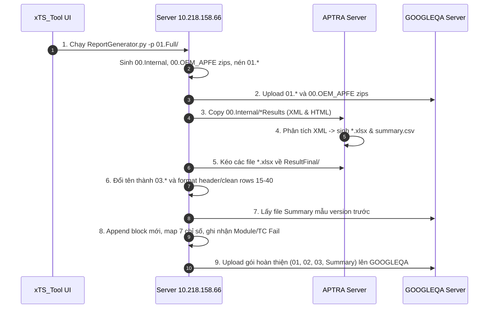

# Bộ Tài Liệu Đặc Tả Kỹ Thuật Tính Năng "Generate Report" Cho `xTS_Tool`

Tài liệu này được biên soạn đầy đủ và chi tiết sau quá trình khảo sát, thực nghiệm và chuẩn hóa toàn bộ luồng tạo báo cáo chứng chỉ Google Certification xTS (Android Automotive OS) trên hệ thống máy chủ LG & Nissan AIVI.

---

## 📑 Danh mục các tài liệu thành phần

| STT | Tài liệu | Nội dung chính |
| :---: | :--- | :--- |
| **01** | [**`01_WORKFLOW_OVERVIEW.md`**](./01_WORKFLOW_OVERVIEW.md) | **Tổng quan kiến trúc & sơ đồ luồng hệ thống:** • Kiến trúc 4 thực thể (Local Client, Server 66, APTRA, GOOGLEQA). • Sơ đồ luồng dữ liệu Mermaid. • Bảng phân định vai trò và thông tin kết nối các máy chủ. |
| **02** | [**`02_STEP_BY_STEP_PIPELINE.md`**](./02_STEP_BY_STEP_PIPELINE.md) | **Quy trình chi tiết 13 bước thực thi:** • Hướng dẫn chi tiết từng bước từ dữ liệu thô `01.Full/`. • Lệnh gọi `ReportGenerator.py`. • Đồng bộ APTRA và GOOGLEQA. • Chuẩn hóa đổi tên `03.` và làm sạch file Excel. • Tạo và cập nhật file Summary và danh sách Fail. |
| **03** | [**`03_DATA_DICTIONARY_AND_FORMATS.md`**](./03_DATA_DICTIONARY_AND_FORMATS.md) | **Từ điển dữ liệu & bảng tính mẫu Excel:** • Bảng tọa độ chính xác từng ô (cell coordinates) cho file `03.` và file Summary. • Bảng demo dữ liệu thực tế trích xuất từ bản build `YAK.31.03.30`. • Quy tắc lọc Fail (`Failed > 0`) và unmerge bảo toàn công thức. |
| **04** | [**`04_INTEGRATION_REQUIREMENTS_XTS_TOOL.md`**](./04_INTEGRATION_REQUIREMENTS_XTS_TOOL.md) | **Yêu cầu kỹ thuật tích hợp vào `xTS_Tool`:** • Thiết kế giao diện (UI Form) với các trường cấu hình và metadata. • Thiết kế các class/module backend (`report_pipeline_engine.py`, `excel_report_formatter.py`). • Cơ chế xử lý ngoại lệ, cảnh báo file mẫu và sao lưu dữ liệu an toàn. |

---

## 🚀 Tóm tắt luồng công việc chính (Quick Flowchart)

---
*Tài liệu được khởi tạo và kiểm chứng trực tiếp trên môi trường máy chủ ngày 10/09/2026.*
