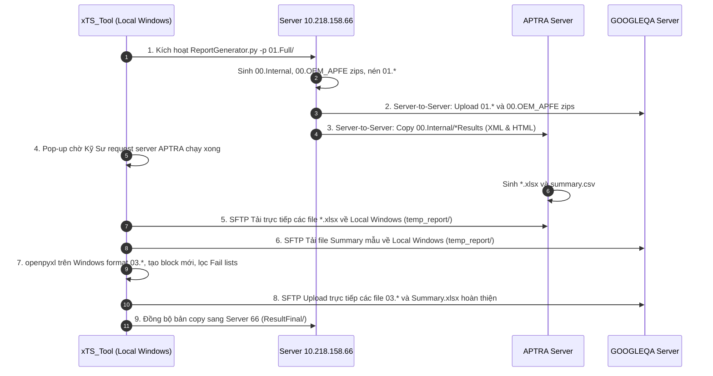

# Bộ Tài Liệu Đặc Tả Kỹ Thuật Tính Năng "Generate Report" Cho `xTS_Tool`

Tài liệu này được biên soạn đầy đủ và hoàn thiện sau quá trình khảo sát, thực nghiệm và chuẩn hóa toàn bộ luồng tạo báo cáo chứng chỉ Google Certification xTS (Android Automotive OS) trên hệ thống máy chủ LG & Nissan AIVI.

---

## 📑 Danh mục các tài liệu thành phần

| STT | Tài liệu | Nội dung chính |
| :---: | :--- | :--- |
| **01** | [**`Question.md`**](./Question.md) | **Tổng hợp câu hỏi làm rõ & Khuyến nghị kỹ thuật:** Toàn bộ giải đáp về APTRA, phương thức truyền file, môi trường xử lý Excel, quy tắc tên file và giao diện UI/UX. |
| **02** | [**`01_WORKFLOW_OVERVIEW.md`**](./01_WORKFLOW_OVERVIEW.md) | **Tổng quan kiến trúc & sơ đồ luồng hệ thống:** Kiến trúc kết hợp Server-to-Server và Local Windows `openpyxl`, bảng kết nối máy chủ. |
| **03** | [**`02_STEP_BY_STEP_PIPELINE.md`**](./02_STEP_BY_STEP_PIPELINE.md) | **Quy trình chi tiết 9 bước thực thi:** Lệnh gọi `ReportGenerator.py`, cơ chế pop-up APTRA, tải trực tiếp về Local, xử lý Excel và xuất bản lên GOOGLEQA. |
| **04** | [**`03_DATA_DICTIONARY_AND_FORMATS.md`**](./03_DATA_DICTIONARY_AND_FORMATS.md) | **Từ điển dữ liệu & bảng tính mẫu Excel:** Tọa độ chính xác từng ô Excel (`C3:C6`, `G2:G6`), cấu trúc sheet Summary, lọc lỗi `Failed > 0`, bảng demo thực tế từ build `YAK.31.03.30`. |
| **05** | [**`04_INTEGRATION_REQUIREMENTS_XTS_TOOL.md`**](./04_INTEGRATION_REQUIREMENTS_XTS_TOOL.md) | **Yêu cầu kỹ thuật tích hợp vào `xTS_Tool`:** Thiết kế Sub-tab 3 `Generate Report`, các class engine backend, chế độ Run All & Step-by-Step, cơ chế an toàn dữ liệu. |

---

## 🚀 Sơ đồ tóm tắt luồng công việc (Sequence Diagram)

---
*Tài liệu được cập nhật và hoàn thiện ngày 11/09/2026.*
